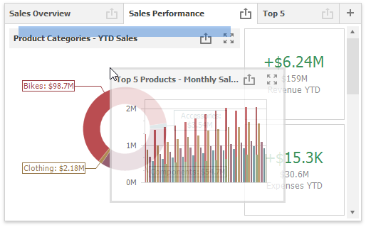
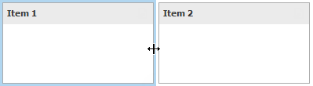
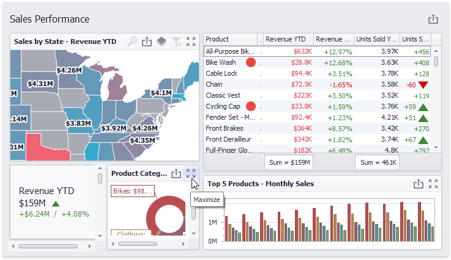
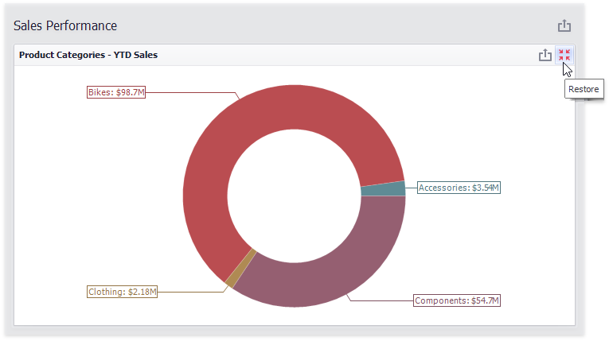
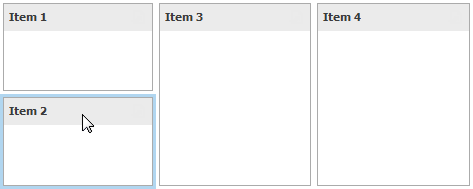
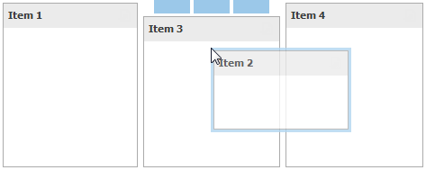
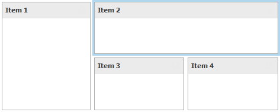

# Dashboard Items Layout
The **Dashboard Designer** provides the capability to arrange and resize dashboard items and [groups](../dashboard-item-settings/dashboard-item-group.md) in various ways, using simple drag-and-drop operations.

* [Layout Concepts](#layout-concepts)
* [Item Resizing](#item-resizing)
* [Maximize and Restore Item](#maximize-and-restore-item)
* [Item Positioning](#item-positioning)

## Layout Concepts
The dashboard arranges dashboard items and [groups](../dashboard-item-settings/dashboard-item-group.md) using _layout items_ and _layout groups_. They are special containers that are used to present a dashboard layout as a hierarchical structure.
* A layout item is used as a container that displays an individual dashboard item.
* A layout group is used as a container that is used to arrange layout items (or other layout groups) either horizontally or vertically. At the same time, layout groups are used as containers that display [dashboard item groups](../dashboard-item-settings/dashboard-item-group.md).

Thus, a dashboard layout is hierarchically arranged from the root layout group to bottommost layout items, which display individual dashboard items.

## Item Resizing
You can resize individual items/groups of items by dragging their edges.

By default, a 2x2 layout group of dashboard items is horizontally oriented and contains two child layout groups. This arranges dashboard items in two 'columns' and allows you to set a different height for items in different columns. You can switch the orientation of the 2x2 group to **Vertical** using the indicator at the group intersection.

This allows you to specify different widths for dashboard items in different 'rows'. The table below lists and describes different modes.

| Indicator | Result | Description |
|---|---|---|
|  |  | Orients the layout group horizontally and allows you to change the height of individual items and the width of 'columns'. |
|  |  | Orients the layout group vertically and allows you to change the width of individual items and the height of 'rows'. |

## Maximize and Restore Item
You can expand any dashboard item into the whole dashboard size to examine data in greater detail. The expanded dashboard item size in this case is the same as the root layout group.

- To maximize a dashboard item, click the **Maximize** button in the [dashboard item caption](dashboard-item-caption.md).

	

- To restore the item size, click **Restore**.

	

## Item Positioning
You can change the position of a dashboard item by using drag-and-drop and one of the following approaches.
* If the [caption](dashboard-item-caption.md) of the dashboard item is visible, click it and hold down the left mouse button while dragging the item.
* If the caption of the dashboard item is not visible, click the  icon in the top left corner, and hold down the left mouse button while dragging the item.

Depending on the required dashboard item position, a new layout group is created (if required) to maintain the arrangement of items. Thus, the dashboard item can be inserted to the desired area of a new or existing dashboard layout group.

The following table illustrates how a dashboard item is dragged.

| Action | Description |
|---|---|
|  | Select the required dashboard item. |
|  | Drag the dashboard item to the expected area. The _drag indicator_ (  ) will show possible positions for the dashboard item. |
|  | Move the mouse cursor to the required position. The _drop indicator_ (  ) highlights the hovered position. |
|  | Then, the _drop indicator_ sequentially displays areas that can be occupied by the dashboard item. Release the left mouse button when the drop indicator displays the required area. |
|  | The dashboard item is moved to a new position. |