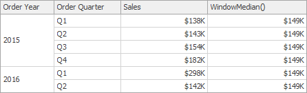

# Expression Constants, Operators, and Functions

The DevExpress Dashboard uses criteria language that you can use in various DevExpress products for building expressions. An expression is a string that evaluates some value. The criteria language is based on the the cross-platform library with some additions and subtractions specific for dashboards. This topic details basic and dashboard-specific constants, operators, and functions. 

The tables below contain constants, operators, and functions you can use in dashboard expressions.

## Constants

| Constant | Description | Example |
|---|---|---|
| String constants | Wrap string constants in apostrophes. If a string contains an apostrophe, double the apostrophe. | [Country] == 'France' or [Name] == 'O''Neil'|
| Date-time constants | Wrap date-time constants in '#'. | [OrderDate] &gt;= #2018-03-22 13:18:51.94944# |
| True | Represents the Boolean True value. | [InStock] == True |
| False | Represents the Boolean False value. | [InStock] == False |
| Enumeration | Specify an enumeration value using its underlying integer value. Note that you cannot specify an enumeration value using its qualified name. | [Status] == 1 |
| Guid | Wrap a Guid constant in curly braces. Use Guid constants in a relational operation with equality or inequality operators only. | [OrderID] == {513724e5-17b7-4ec6-abc4-0eae12c72c1f} |
| Numeric | Specify different numeric constant types in a string form using suffixes: Int32 (int) - _1_, Int16 (short) - _1s_, Byte (byte) - _1b_, Double (double) - _1.0_, Single (float) - _1.0f_, Decimal (decimal) - _1.0m_, | [Price] == 25.0m |
| ? | Represents a null reference that does not refer to any object. We recommend using the **IsNull** unary operator (for example, "[Region] is null") or the **IsNull** logical function (for example, "IsNull([Region])") instead. | [Region] != ? |

You can build parameterized criteria using any number of positional parameters. To do this, add parameter placeholders (question mark characters) to a criteria expression to identify parameter positions and provide a list of parameter values. When building criteria, parameter placeholders are substituted with parameter values in values in the order they are listed.

_CriteriaOperator.Parse("[Name] == ? and [Age] == ?", "John", 33)_

The following two examples are identical, but the second one allows you to avoid formatting errors.

_CriteriaOperator.Parse("[OrderDate] >= #1/1/2009#")_

_CriteriaOperator.Parse("[OrderDate] >= ?", new DateTime(2009, 1, 1))_

When parameters are not specified, a parameter placeholder is substituted with null.

_CriteriaOperator.Parse("[Region] != ?")_

## Operators

| Operator | Description | Example |
|--|--|--|
| + | Adds the value of one numeric expression to another or concatenates two strings. | [UnitPrice] + 4 or [FirstName] + ' ' + [LastName] |
| - | Finds the difference between two numbers. | [Price1] - [Price2] |
| * | Multiplies the value of two expressions. | [Quantity] * [UnitPrice] * (1 - [BonusAmount]) |
| / | Divides the first operand by the second. | [Quantity] / 2 |
| % | Returns the remainder (modulus) obtained by dividing one numeric expression by another. | [Quantity] % 3 |
| \| | Performs a bitwise inclusive OR on two numeric expressions. Compares each bit of its first operand to the corresponding bit of its second operand. If either  bit is 1, the corresponding resulting bit is set to 1. Otherwise, the corresponding resulting bit is set to 0. | [Flag1] | [Flag2] |
| &amp; | The bitwise AND operator. Compares each bit of its first operand to the corresponding bit of its second operand. If both bits are 1, the corresponding resulting bit is set to 1. Otherwise, the corresponding resulting bit is set to 0. | [Flag] &amp; 10 |
| ^ | Performs a bitwise exclusive OR on two numeric expressions. | [Flag1] ^ [Flag2] |
| == | Returns true if both operands have the same value; otherwise, it returns false. | [Quantity] == 10 |
| = | Returns true if both operands have the same value; otherwise, it returns false. | [Quantity] = 10 |
| != | Returns true if the operands do not have the same value; otherwise, it returns false. | [Country] != 'France' |
| &lt; | Less than operator. Used to compare expressions. | [UnitPrice] &lt; 20 |
| &lt;= | Less than or equal to operator. Used to compare expressions. | [UnitPrice] &lt;= 20 |
| &gt;= | Greater than or equal to operator. Used to compare expressions. | [UnitPrice] &gt;= 30 |
| &gt; | Greater than operator. Used to compare expressions. | [UnitPrice] &gt; 30 |
| In (,,,) | Tests for the existence of a property in an object. | [Country] In ('USA', 'UK', 'Italy') |
| Between (,) | Specifies a range to test. Returns true if a value is greater than or equal to the first operand and less than or equal to the second operand. | [Quantity] Between (10, 20) |
| And  | Performs a logical conjunction on two Boolean expressions. | [InStock] And ([ExtendedPrice]> 100) |
| &amp;&amp;  | Performs a logical conjunction on two Boolean expressions. | [InStock] &amp;&amp; ([ExtendedPrice]> 100) |
| Or | Performs a logical disjunction on two Boolean expressions. | [Country]=='USA' Or [Country]=='UK' |
| \| | Performs a logical disjunction on two Boolean expressions. | [Country]=='USA' \| [Country]=='UK' | 
| ~ | Performs a bitwise negation on a numeric expression. | ~[Roles] = 251 |
| Not | Performs a logical negation on a Boolean expression. | Not [InStock] |
| ! | Performs a logical negation on a Boolean expression. | ![InStock] |
| + | Returns a numeric expression's value (a unary operator). | +[Value] = 10 |
| - | Returns the negative of a numeric expression's value (a unary operator). | -[Value] = 20 |
| Is Null | Returns true if an expression is a null reference, the one that does not refer to any object. | [Region] is null |

## Functions

**Advanced Functions - Intermediate Aggregation Level**

| Function | Description | Example | 
|---|---|---|
| aggr(SummaryExpression, Dimensions) | Uses the detail level specified by a predefined set of dimensions and a specified summary function to aggregate underlying data.| aggr(Sum([Sales]), [Category], [Product]) |
| w(WindowExpression, partitionByFunction, orderByFunction) | Calculates aggregated values with the specified window function for the window defined by the specified partitioning and ordering. | w(RankDense(Sum([ProductSales]), 'desc'), partitionBy([CategoryName]), orderBy()) |
| partitionBy(column1, column2, ...) | Specifies the columns by which the data rows are partitioned. The window function is applied to each partition separately. Note that the _partitionBy_ function can be used only as a w function argument. | partitionBy([Product])|
| orderBy(column1, column2, ...) | Specifies the logical order in which the window function calculation is performed on the rows in the window. The _orderBy_ function can be used only as a w function argument.| orderBy(GetYear([Date]), desc(Sum([Sales]))) |
| asc(column) | Specifies that the values in the specified column are sorted in ascending order. This is the default sort order. The _asc_ function can be used only as a w function argument. |asc(Sum([Sales]))|
| desc(column) | Specifies that the values in the specified column are sorted in descending order. The _desc_ function can be used only as a w function argument. | desc(Sum([Sales]))|

**Aggregate Functions**

| Function | Description | Example |
|---|---|---|
| Avg(Value) | Returns the average of all the values in the expression. | Avg([Profit]) | 
| Count() | Returns the number of values. | Count() |
| CountNotNull(Value) | Returns a number of non-null objects in a collection. | CountNotNull([Orders]) |
| CountDistinct(Value) | Returns the number of distinct values. | CountDistinct([Orders]) |
| Max(Value) | Returns the maximum value across all records. | Max([Profit]) |
| Min(Value) | Returns the minimum value across all records. | Min([Profit]) |
| Mode(Value) | Returns the mode of the values. | Mode([Profit]) |
| Median(Value) | Returns the median of the values. | Median([Profit]) |
| Sum(Value) | Returns the sum of all values. | Sum([Profit]) |
| Var(Value) | Returns an estimate of the variance of a population, where the sample is a subset of the entire population. | Var([Orders]) |
| Varp(Value) | Returns the variance of a population, where the population is the entire data to be summarized. | Varp([Orders]) |
| StdDev(Value) | Returns an estimate of the standard deviation of a population, where the sample is a subset of the entire population. | StdDev([Orders]) |
| StdDevp(Value) | Returns the standard deviation of a population, where the population is the entire data to be summarized. | StdDevp([Orders]) |

**Window Functions**

| Function | Description | Example | Image |
|--|--|--|--|
| Last() | Returns the number of rows from the current row to the last row in the window. | Last() |  |
| First() | Returns the number of rows from the current row to the first row in the window. | First() |  |
| Index() | Returns the index of the current row in the window. | Index() |  |
| Size() | Returns the number of rows in the window. | Size() |  |
| Lookup(SummaryExpression, Position) | Returns the value of the expression in a target position specified as a relative offset from the current position. | Lookup(Sum([Sales]), 3) |  |
| RankCompetition(SummaryExpression, [ 'asc' | 'desc' ]) | Returns the standard competition rank for the current row in the window. | RankCompetition(Sum([Sales]), 'asc') | - |
| RankDense(SummaryExpression, [ 'asc' | 'desc' ]) | Returns the dense rank for the current row in the window. | RankDense(Sum([Sales]), 'asc') | - |
| RankUnique(SummaryExpression, [ 'asc' | 'desc' ]) | Returns the unique rank for the current row in the window. | RankUnique(Sum([Sales]), 'asc') | - |
| RankModified(SummaryExpression, [ 'asc' | 'desc' ]) | Returns the modified competition rank for the current row in the window. | RankModified(Sum([Sales]), 'asc')  | - |
| RankPercentile(SummaryExpression, [ 'asc' | 'desc' ]) | Returns the percentile rank for the current row in the window. | RankPercentile(Sum([Sales]), 'desc') | - |
| RunningAvg(SummaryExpression) | Returns the running average of the specified expression from the first row in the window to the current row. | RunningAvg(Sum([Sales])) |  |
| RunningCount(SummaryExpression) | Returns the running count of the specified expression from the first row in the window to the current row. | RunningCount(Sum([Sales])) | - |
| RunningMax(SummaryExpression) | Returns the running maximum of the specified expression from the first row in the window to the current row. | | RunningMax(Sum([Sales])) |  |
| RunningMin(SummaryExpression) | Returns the running minimum of the specified expression from the first row in the window to the current row. | RunningMin(Sum([Sales])) |  |
| RunningSum(SummaryExpression) | Returns the running sum of the specified expression from the first row in the window to the current row. | RunningSum(Sum([Sales])) |  |
| WindowAvg(SummaryExpression, StartOffset, EndOffset) | Returns the average of the expression within the window, which is defined using offsets from the current row. | WindowAvg(Sum([Sales]), First(), Last()) |  |
| WindowCount(SummaryExpression, StartOffset, EndOffset) | Returns the count of the expression within the window. | WindowCount(Sum([Sales]), First()+2, Last()) | 
 |
| WindowCountDistinct(SummaryExpression, StartOffset, EndOffset) | Returns the distinct count of the expression within the window. | WindowCountDistinct(Sum([Sales]), First(), Last()) | - |
| WindowMax(SummaryExpression, StartOffset, EndOffset) | Returns the maximum of the expression within the window. | WindowMax(Sum([Sales]), First(), Last()) |  |
| WindowMin(SummaryExpression, StartOffset, EndOffset) | Returns the minimum of the expression within the window. | WindowMin(Sum([Sales]), First(), Last()) |  |
| WindowMode(SummaryExpression, StartOffset, EndOffset) | Returns the mode of the expression within the window. | WindowMode(Sum([Sales]), First(), Last()) | - |
| WindowMedian(SummaryExpression, StartOffset, EndOffset) | Returns the median of the expression within the window. | WindowMedian(Sum([Sales]), First(), Last()) |  |
| WindowSum(SummaryExpression, StartOffset, EndOffset) | Returns the sum of the expression within the window. | WindowSum(Sum([Sales]), First()+2, Last()) |  |
| WindowVar(SummaryExpression, StartOffset, EndOffset) | Returns the variance of the expression within the window. | WindowVar(Sum([Sales]), First(), Last()) | - |
| WindowVarp(SummaryExpression, StartOffset, EndOffset) | Returns the biased variance of the expression within the window. | WindowVarp(Sum([Sales]), First(), Last()) | - |
| WindowStdDev(SummaryExpression, StartOffset, EndOffset) | Returns the sample standard deviation of the expression within the window. | WindowStdDev(Sum([Sales]), First(), Last()) | - |
| WindowStdDevp(SummaryExpression, StartOffset, EndOffset) | Returns the biased standard deviation of the expression within the window. | WindowStdDevp(Sum([Sales]), First(), Last()) | - |
| Total(SummaryExpression) | Returns the total based on values from the underlying data source for the specified expression in a calculation window. | Total(Sum([Sales])) |  |

> [!IMPORTANT]
> Note that window functions cannot be used inside [Aggr](aggregations.md).

**Date-time Functions**

| Function | Description | Example | 
|---|---|---|
| AddDays(DateTime, DaysCount) | Returns a date-time value that is the specified number of days from the specified DateTime. | AddDays([OrderDate], 30) | 
| AddHours(DateTime, HoursCount) | Returns a date-time value that is the specified number of hours from the specified DateTime. | AddHours([StartTime], 2) | 
| AddMilliSeconds(DateTime, MilliSecondsCount) | Returns a date-time value that is the specified number of milliseconds from the specified DateTime. | AddMilliSeconds(([StartTime], 5000)) | 
| AddMinutes(DateTime, MinutesCount) | Returns a date-time value that is the specified number of minutes from the specified DateTime. | AddMinutes([StartTime], 30) | 
| AddMonths(DateTime, MonthsCount) | Returns a date-time value that is the specified number of months from the specified DateTime. | AddMonths([OrderDate], 1) | 
| AddSeconds(DateTime, SecondsCount) | Returns a date-time value that is the specified number of seconds from the specified DateTime. | AddSeconds([StartTime], 60) | 
| AddTicks(DateTime, TicksCount) | Returns a date-time value that is the specified number of ticks from the specified DateTime. | AddTicks([StartTime], 5000) | 
| AddTimeSpan(DateTime, TimeSpan) | Returns a date-time value that is from the specified DateTime for the given TimeSpan. | AddTimeSpan([StartTime], [Duration]) | 
| AddYears(DateTime, YearsCount) | Returns a date-time value that is the specified number of years from the specified DateTime. | AddYears([EndDate], -1) | 
| DateDiffDay(startDate, endDate) | Returns the number of day boundaries between two non-nullable dates. | DateDiffDay([StartTime], Now()) | 
| DateDiffHour(startDate, endDate) | Returns the number of hour boundaries between two non-nullable dates. | DateDiffHour([StartTime], Now()) | 
| DateDiffMilliSecond(startDate, endDate) | Returns the number of millisecond boundaries between two non-nullable dates. | DateDiffMilliSecond([StartTime], Now()) | 
| DateDiffMinute(startDate, endDate) | Returns the number of minute boundaries between two non-nullable dates. | DateDiffMinute([StartTime], Now()) | 
| DateDiffMonth(startDate, endDate) | Returns the number of month boundaries between two non-nullable dates. | DateDiffMonth([StartTime], Now()) | 
| DateDiffSecond(startDate, endDate) | Returns the number of second boundaries between two non-nullable dates. | DateDiffSecond([StartTime], Now()) | 
| DateDiffTick(startDate, endDate) | Returns the number of tick boundaries between two non-nullable dates. | DateDiffTick([StartTime], Now()) | 
| DateDiffYear(startDate, endDate) | Returns the number of year boundaries between two non-nullable dates. | DateDiffYear([StartTime], Now()) | 
| GetDate(DateTime) | Extracts a date from the defined DateTime. | GetDate([OrderDateTime]) | 
| GetDateHour(DateTime) | Extracts the date part with the hour value from the defined DateTime. | GetDateHour([OrderDate]) | 
| GetDateHourMinute(DateTime) | Extracts the date part with the hour and minute values from the defined DateTime. | GetDateHourMinute([OrderDate]) | 
| GetDateHourMinuteSecond(DateTime) | Extracts the date part with the hour, minute, and second values from the defined DateTime. | GetDateHourMinuteSecond([OrderDate]) | 
| GetDateMonthYear(DateTime) | Extracts the date with the month and year from the defined DateTime. | GetDateMonthYear([OrderDate]) | 
| GetDateQuarterYear(DateTime) | Extracts the date with the quarter and year from the defined DateTime. | GetDateQuarterYear([OrderDate]) | 
| GetDay(DateTime) | Extracts a day from the defined DateTime. | GetDay([OrderDate]) | 
| GetDayOfWeek(DateTime) | Extracts a day of the week from the defined DateTime. | GetDayOfWeek([OrderDate]) | 
| GetDayOfYear(DateTime) | Extracts a day of the year from the defined DateTime. | GetDayOfYear([OrderDate]) | 
| GetHour(DateTime) | Extracts an hour from the defined DateTime. | GetHour([StartTime]) | 
| GetMilliSecond(DateTime) | Extracts milliseconds from the defined DateTime. | GetMilliSecond([StartTime]) | 
| GetMinute(DateTime) | Extracts minutes from the defined DateTime. | GetMinute([StartTime]) | 
| GetMonth(DateTime) | Extracts a month from the defined DateTime. | GetMonth([StartTime]) | 
| GetSecond(DateTime) | Extracts seconds from the defined DateTime. | GetSecond([StartTime]) | 
| GetTimeOfDay(DateTime) | Extracts the time of the day from the defined DateTime in ticks. | GetTimeOfDay([StartTime]) | 
| GetWeekOfMonth(DateTime) | Extracts the week of the month from the defined DateTime. | GetWeekOfMonth([OrderDate]) | 
| GetWeekOfYear(DateTime) | Extracts the week of the year from the defined DateTime. | GetWeekOfYear([OrderDate]) |
| GetYear(DateTime) | Extracts a year from the defined DateTime. | GetYear([StartTime]) | 
| IsApril(DateTime) | Returns True if the specified date falls within April. | IsApril([OrderDate]) | 
| IsAugust(DateTime) | Returns True if the specified date falls within August. | IsAugust([OrderDate]) | 
| IsDecember(DateTime) | Returns True if the specified date falls within December. | IsDecember([OrderDate]) | 
| IsFebruary(DateTime) | Returns True if the specified date falls within February. | IsFebruary([OrderDate]) | 
| IsJanuary(DateTime) | Returns True if the specified date falls within January. | IsJanuary([OrderDate]) | 
| IsJuly(DateTime) | Returns True if the specified date falls within July. | IsJuly([OrderDate]) | 
| IsJune(DateTime) | Returns True if the specified date falls within June. | IsJune([OrderDate]) | 
| IsLastMonth(DateTime) | Returns True if the specified date falls within the previous month. | IsLastMonth([OrderDate]) | 
| IsLastYear(DateTime) | Returns True if the specified date falls within the previous year. | IsLastYear([OrderDate]) | 
| IsMarch(DateTime) | Returns True if the specified date falls within March. | IsMarch([OrderDate]) | 
| IsMay(DateTime) | Returns True if the specified date falls within May. | IsMay([OrderDate]) | 
| IsNextMonth(DateTime) | Returns True if the specified date falls within the next month. | IsNextMonth([OrderDate]) | 
| IsNextYear(DateTime) | Returns True if the specified date falls within the next year. | IsNextYear([OrderDate]) | 
| IsNovember(DateTime) | Returns True if the specified date falls within November. | IsNovember([OrderDate]) | 
| IsOctober(DateTime) | Returns True if the specified date falls within October. | IsOctober([OrderDate]) | 
| IsSameDay(DateTime) | Returns True if the specified date/time values fall within the same day. | IsSameDay([OrderDate]) | 
| IsSeptember(DateTime) | Returns True if the specified date falls within September. | IsSeptember([OrderDate]) | 
| IsThisMonth(DateTime) | Returns True if the specified date falls within the current month. | IsThisMonth([OrderDate]) | 
| IsThisWeek(DateTime) | Returns True if the specified date falls within the current week. | IsThisWeek([OrderDate]) | 
| IsYearToDate(DateTime) | Returns True if the specified date falls within the year-to-date period. This period starts from the first day of the current year and continues to the current date (including the current date). | IsYearToDate([OrderDate]) | 
| IsThisYear(DateTime) | Returns True if the specified date falls within the current year. | IsThisYear([OrderDate]) | 
| LocalDateTimeDayAfterTomorrow() | Returns a date-time value corresponding to the day after Tomorrow. | AddDays(LocalDateTimeDayAfterTomorrow(), 5) | 
| LocalDateTimeLastMonth() | Returns the DateTime value corresponding to the first day of the previous month. | AddMonths(LocalDateTimeLastMonth(), 5) | 
| LocalDateTimeLastWeek() | Returns a date-time value corresponding to the first day of the previous week. | AddDays(LocalDateTimeLastWeek(), 5) | 
| LocalDateTimeLastYear() | Returns the DateTime value corresponding to the first day of the previous year. | AddYears(LocalDateTimeLastYear(), 5) | 
| LocalDateTimeNextMonth() | Returns a date-time value corresponding to the first day of the next month. | AddMonths(LocalDateTimeNextMonth(), 5) | 
| LocalDateTimeNextWeek() | Returns a date-time value corresponding to the first day of the following week. | AddDays(LocalDateTimeNextWeek(), 5) | 
| LocalDateTimeNextYear() | Returns a date-time value corresponding to the first day of the following year. | AddYears(LocalDateTimeNextYear(), 5) | 
| LocalDateTimeNow() | Returns a date-time value corresponding to the current moment in time. | AddDays(LocalDateTimeNow(), 5) | 
| LocalDateTimeThisMonth() | Returns a date-time value corresponding to the first day of the current month. | AddMonths(LocalDateTimeThisMonth(), 5) | 
| LocalDateTimeThisWeek() | Returns a date-time value corresponding to the first day of the current week. | AddDays(LocalDateTimeThisWeek(), 5) | 
| LocalDateTimeThisYear() | Returns a date-time value corresponding to the first day of the current year. | AddYears(LocalDateTimeThisYear(), 5) | 
| LocalDateTimeToday() | Returns a date-time value corresponding to Today. | AddDays(LocalDateTimeToday(), 5) | 
| LocalDateTimeTomorrow() | Returns a date-time value corresponding to Tomorrow. | AddDays(LocalDateTimeTomorrow(), 5) | 
| LocalDateTimeTwoMonthsAway() | Returns the DateTime value corresponding to the first day of the following month. | AddMonths(LocalDateTimeTwoMonthAway(), 5) | 
| LocalDateTimeTwoWeeksAway() | Returns the DateTime value corresponding to the first day of the following week. | AddDays(LocalDateTimeTwoWeeksAway(), 5) | 
| LocalDateTimeTwoYearsAway() | Returns the DateTime value corresponding to the first day of the following year. | AddYears(LocalDateTimeTwoYearsAway(), 5) | 
| LocalDateTimeYearBeforeToday() | Returns the DateTime value corresponding to the day one year ago. | AddYears(LocalDateTimeYearBeforeToday(), 5) | 
| LocalDateTimeYesterday() | Returns a date-time value corresponding to Yesterday. | AddDays(LocalDateTimeYesterday(), 5) | 
| MakeDateTime(Year, Month, Day) | Returns a date value constructed from the specified Year, Month and Day. | MakeDateTime(2018, 5, 5) |
| MakeDateTime(Year, Month, Day, Hour) | Returns a date value constructed from the specified Year, Month, Day and Hour. | MakeDateTime(2018, 5, 5, 20) |
| MakeDateTime(Year, Month, Day, Hour, Minute) | Returns a date value constructed from the specified Year, Month, Day, Hour and Minute. | MakeDateTime(2018, 5, 5, 20, 18) |
| MakeDateTime(Year, Month, Day, Hour, Minute, Second) | Returns a date value constructed from the specified Year, Month, Day, Hour, Minute and Second. | MakeDateTime(2018, 5, 5, 20, 18, 30) |
| Now() | Returns the current system date and time. | AddDays(Now(), 5) | 
| ToDateTime(Value) | Converts Value to a DateTime value. | ToDateTime([Orders]) |
| Today() | Returns the current date. Regardless of the actual time, this function returns midnight of the current date. | AddMonths(Today(), 1) | 
| UtcNow() | Returns the current system date and time, expressed as Coordinated Universal Time (UTC). | AddDays(UtcNow(), 7) | 

**Logical Functions**

{|
|-

! Function
! Description
! Example
|-

| Iif(Expression1, True_Value1, ..., ExpressionN, True_ValueN, False_Value)
| Returns one of several specified values depending upon the values of logical expressions.

The function can take *2N+1* arguments (*N* - the number of specified logical expressions):

- Each odd argument specifies a logical expression;

- Each even argument specifies the value that is returned if the previous expression evaluates to **true**; 

- **...**

- The last argument specifies the value that is returned if the previously evaluated logical expressions yielded **false**.
| Iif(Name = 'Bob', 1, 0)") 

Iif(Name = 'Bob', 1, Name = 'Dan', 2, Name = 'Sam', 3, 0)
 
|-

| IsNull(Value)
| Returns True if the specified Value is NULL.
| IsNull([OrderDate])
|-

| IsNull(Value1, Value2)
| Returns Value1 if it is not set to NULL; otherwise, Value2 is returned.
| IsNull([ShipDate], [RequiredDate])
|-

| IsNullOrEmpty(String)
| Returns True if the specified String object is NULL or an empty string; otherwise, False is returned.
| IsNullOrEmpty([ProductName])
|-

| ToBoolean(Value)
| Converts Value to an equivalent Boolean value.
| ToBoolean([Value])
|}

**Math Functions**

| Function | Description | Example |
|---|---|---|
| Abs(Value) | Returns the given numeric expression's absolute, positive value. | Abs(1 - [Discount]) |
| Acos(Value) | Returns a number's arccosine (the angle in radians, whose cosine is the given float expression). | Acos([Value]) | 
| Asin(Value) | Returns a number's arcsine (the angle in radians, whose sine is the given float expression). | Asin([Value]) | 
| Atn(Value) | Returns a number's arctangent (the angle in radians, whose tangent is the given float expression). | Atn([Value]) | 
| Atn2(Value1, Value2) | Returns the angle whose tangent is the quotient of two specified numbers in radians. | Atn2([Value1], [Value2]) | 
| BigMul(Value1, Value2) | Returns an Int64 containing the full product of two specified 32-bit numbers. | BigMul([Amount], [Quantity]) | 
| Ceiling(Value) | Returns the smallest integer that is greater than or equal to the numeric expression. | Ceiling([Value]) | 
| Cos(Value) | Returns the angle's cosine, in radians. | Cos([Value]) | 
| Cosh(Value) | Returns the angle's hyperbolic cosine, in radians. | Cosh([Value]) | 
| Exp(Value) | Returns the float expression's exponential value. | Exp([Value]) | 
| Floor(Value) | Returns the largest integer less than or equal to the numeric expression. | Floor([Value]) | 
| Log(Value) | Returns a specified number's natural logarithm. | Log([Value]) | 
| Log(Value, Base) | Returns the logarithm of a specified number in a specified Base. | Log([Value], 2) | 
| Log10(Value) | Returns a specified number's base 10 logarithm. | Log10([Value]) | 
| Max(Value1, Value2) | Returns the maximum value from the specified values. | Max([Value1], [Value2]) | 
| Min(Value1, Value2) | Returns the minimum value from the specified values. | Min([Value1], [Value2]) | 
| Power(Value, Power) | Returns a specified number raised to a specified power. | Power([Value], 3) | 
| Rnd() | Returns a random number that is less than 1, but greater than or equal to zero. | Rnd()*100 | 
| Round(Value) | Rounds the given value to the nearest integer. | Round([Value]) | 
| Round(Value, Precision) | Rounds the given value to the nearest integer, or to a specified number of decimal places. | Round([Value], 2) | 
| Sign(Value) | Returns the positive (+1), zero (0), or negative (-1) sign of the given expression. | Sign([Value]) | 
| Sin(Value) | Returns the sine of the angle defined in radians. | Sin([Value]) | 
| Sinh(Value) | Returns the hyperbolic sine of the angle defined in radians. | Sinh([Value]) | 
| Sqr(Value) | Returns the square root of a given number. | Sqr([Value]) | 
| Tan(Value) | Returns the tangent of the angle defined in radians. | Tan([Value]) | 
| Tanh(Value) | Returns the hyperbolic tangent of the angle defined in radians. | Tanh([Value]) | 
| ToDecimal(Value) | Converts Value to an equivalent decimal number. | ToDecimal([Value]) | 
| ToDouble(Value) | Converts Value to an equivalent 64-bit double-precision floating-point number. | ToDouble([Value]) | 
| ToFloat(Value) | Converts Value to an equivalent 32-bit single-precision floating-point number. | ToFloat([Value]) | 
| ToInt(Value) | Converts Value to an equivalent 32-bit signed integer. | ToInt([Value]) | 
| ToLong(Value) | Converts Value to an equivalent 64-bit signed integer. | ToLong([Value]) | 

**String Functions**

| Function | Description | Example |
|---|---|---|
| Ascii(String) | Returns the ASCII code value of the leftmost character in a character expression. | Ascii('a') | 
| Char(Number) | Converts an integerASCIICode to a character. | Char(65) + Char(51) | 
| CharIndex(String1, String2) | Returns the starting position of String1 within String2, beginning from the zero character position to the end of a string. | CharIndex('e', 'devexpress') | 
| CharIndex(String1, String2, StartLocation) | Returns the starting position of String1 within String2, beginning from the StartLocation character position to the end of a string. | CharIndex('e', 'devexpress', 2) | 
| Concat(String1, ... , StringN) | Returns a string value containing the concatenation of the current string with any additional strings. | Concat('A', ')', [ProductName]) | 
| EndsWith(String1, SubString1) | Returns True if the end of String1 matches SubString1; otherwise, False is returned. | EndsWith([Description], 'The end.') | 
| Insert(String1, StartPosition, String2) | Inserts String2 into String1 at the position specified by StartPositon | Insert([Name], 0, 'ABC-') | 
| Len(Value) | Returns an integer containing either the number of characters in a string or the nominal number of bytes required to store a variable. | Len([Description]) | 
| Lower(String) | Returns String in lowercase. | Lower([ProductName]) | 
| PadLeft(String, Length) | Left-aligns the defined string's characters, padding its left side with white space characters up to a specified total length. | PadLeft([Name], 30) | 
| PadLeft(String, Length, Char) | Left-aligns the defined string's characters, padding its left side with the specified Char up to a specified total length. | PadLeft([Name], 30, '&lt;') | 
| PadRight(String, Length) | Right-aligns the defined string’s characters, padding its left side with empty space characters up to a specified total length. | PadRight([Name], 30) | 
| PadRight(String, Length, Char) | Right-aligns the defined string’s characters, padding its left side with the specified Char up to a specified total length. | PadRight([Name], 30, '>') | 
| Remove(String, StartPosition) | Deletes all the characters from this instance, beginning at a specified position. | Remove([Name], 3) | 
| Remove(String, StartPosition, Length) | Deletes a specified number of characters from this instance, beginning at a specified position. | Remove([Name], 0, 3) | 
| Replace(String, SubString2, String3) | Returns a copy of String1, in which SubString2 has been replaced with String3. | Replace([Name], 'The ', '') | 
| Reverse(String) | Reverses the order of elements within String. | Reverse([Name]) | 
| StartsWith(String1, SubString1) | Returns True if the beginning of String1 matches SubString1; otherwise, False. | StartsWith([Title], 'The best') | 
| Substring(String, StartPosition, Length) | Retrieves a substring from String. The substring starts at StartPosition and has a specified Length. | Substring([Description], 2, 3) | 
| Substring(String, StartPosition) | Retrieves a substring from String. The substring starts at StartPosition. | Substring([Description], 2) | 
| ToStr(Value) | Returns a string representation of an object. | ToStr([ID]) | 
| Trim(String) | Removes all leading and trailing SPACE characters from String. | Trim([ProductName]) | 
| Upper(String) | Returns String in uppercase. | Upper([ProductName]) | 

## Operator Precedence
When an expression contains multiple operators, their precedence controls the order in which expression elements are evaluated.

* Literal values
* Parameters
* Identifiers
* OR (left-associative)
* AND (left-associative)
* ==, !=
* &lt;, &gt;, &lt;=, &gt;=
* -, + (left-associative)
* *, /, % (left-associative)
* NOT
* unary -
* In
* Iif
* Trim(), Len(), Substring(), IsNull()
* '[]' (for set-restriction)
* '()'

The default precedence can be changed by grouping elements with parentheses. For instance, the operators are performed in a default order in the first of the following two code samples. In the second code sample, the addition operation is performed first, because its associated elements are grouped with parentheses, and the multiplication operation is performed last.

_Amount == 2 + 48 * 2_

_Amount == (2 + 48) * 2_

## Case Sensitivity
Operators are case insensitive. Although field values’ case sensitivity depends on the data source.

> [!NOTE]
> A data source affects certain operators' behavior. For instance, by default, the SQL Server Express 2005 is configured as case insensitive. In this case, the following expression always evaluates to **true**:
> 
> _Lower(Name) == Upper(Name)_

## Escape Keywords
You can mark a keyword&#0045;like field name with an escape character (@ sign). In the expression below, the **CriteriaOperator.Parse** method interprets \@Or as the field named "Or", not the logical operator OR.

_\@Or = 'value'_

## Escape Characters
 
Use a backslash (\) as an escape character for characters in expressions. Examples:

- \\[
- \\\
- \\'
