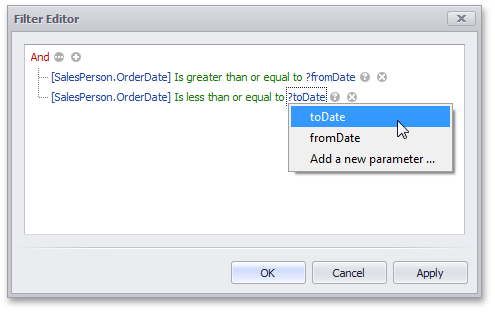

# Passing Parameter Values
In this topic, you will learn how to pass parameter values to a dashboard.
* [SQL Queries](#sql-queries)
* [Filtering](#filtering)
* [Conditional Formatting](#conditional-formatting)
* [Calculated Fields](#calculated-fields)
* [Window Calculations](#window-calculations)

## <a name="sql-queries"/>SQL Queries
The Dashboard Designer provides the capability to use a dashboard parameter as an SQL query/stored procedure parameter. To pass a dashboard parameter to an [SQL query](../../work-with-data/pass-query-parameters.md)/[stored procedure](../../work-with-data/stored-procedures.md) in the [Data Source](../../provide-data/connecting-to-sql-databases.md) wizard or [Query Editor](../../work-with-data/using-the-query-editor.md), do the following.
* Create a [query parameter](../../work-with-data/pass-query-parameters.md) or select the required [stored procedure](../../work-with-data/stored-procedures.md) parameter.
* Enable the **Expression** checkbox for this parameter and select the required dashboard parameter in the **Value** column.
	
	
	
	If necessary, you can select **Expression editor...** and specify an [expression](../../data-analysis/expression-constants-operators-and-functions.md) to bind a query parameter to a dashboard parameter using custom logic.

## <a name="filtering"/>Filtering
You can filter the specified [query](../../work-with-data/filter-queries.md) of the [SQL Data Source](../../provide-data/connecting-to-sql-databases.md) or [apply filtering](../../data-shaping/filtering.md) to a specific dashboard item according to the current parameter value(s) using the [Filter Editor](../../../../../interface-elements-for-desktop/articles/filter-editor.md).

In the Filter Editor, you can compare a field value with the following objects.
* _A static value_ (represented by the  icon). Click this button to switch to the next item mode ("another field value"), to compare the field value with another field value.
* _Another field value_ (represented by the  icon). Click this button to switch to the next item mode (“parameter value”), to compare the field value with a parameter value.
* _A parameter value_ (represented by the  icon). Click this button to switch back to the initial mode ("static value"), to compare the field value with a static value.

Thus, to compare a field value with a parameter value, click the  button, then click the  button.

## <a name="conditional-formatting"/>Conditional Formatting
You can apply conditional formatting to a specific dashboard item according to the current parameter value when creating the [Expression](../../appearance-customization/conditional-formatting/expression.md) format condition. In the **Expression** dialog, you can compare a field value with parameter values in the same manner as in the **Filter Editor** dialog.

## <a name="calculated-fields"/>Calculated Fields
You can use parameters when constructing expressions for [calculated fields](../../work-with-data/creating-calculated-fields.md). This allows you to dynamically evaluate values of the calculated field depending on the current parameter value.

To include the required parameter in the calculated field expression, click **Parameters** in the Expression Editor dialog and double-click the required parameter.

## <a name="window-calculations"/>Window Calculations
You can use parameters when customizing expressions for [window calculations](../window-calculations.md). This allows you to apply a calculation dynamically, depending on the current parameter value.

