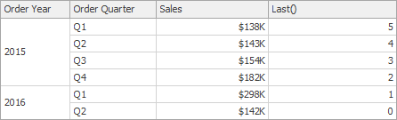
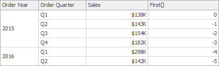
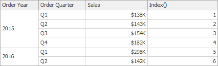
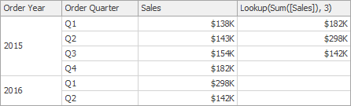
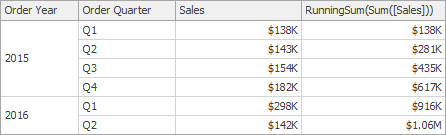
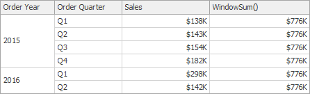
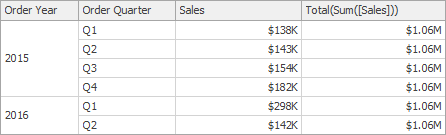

# Calculation Functions Reference
This topic contains the descriptions of window functions that can be used to specify measure expressions.

| Function | Description | Example | Image |
|---|---|---|---|
| Last() | Returns the number of rows from the current row to the last row in the window. | Last() |  |
| First() | Returns the number of rows from the current row to the first row in the window. | First() |  |
| Index() | Returns the index of the current row in the window. | Index() |  |
| Size() | Returns the number of rows in the window. | Size() |  |
| Lookup(SummaryExpression, Position) | Returns the value of the expression in a target position specified as a relative offset from the current position. | Lookup(Sum([Sales]), 3) |  | - |
| RankCompetition(SummaryExpression, [ 'asc' | 'desc' ]) | Returns the standard competition rank for the current row in the window. | RankCompetition(Sum([Sales]), 'asc') | - |
| RankDense(SummaryExpression, [ 'asc' | 'desc' ]) | Returns the dense rank for the current row in the window. | RankDense(Sum([Sales]), 'asc') | - |
| RankUnique(SummaryExpression, [ 'asc' | 'desc' ]) | Returns the unique rank for the current row in the window. | RankUnique(Sum([Sales]), 'asc') | - |
| RankModified(SummaryExpression, [ 'asc' | 'desc' ]) | Returns the modified competition rank for the current row in the window. | RankModified(Sum([Sales]), 'asc') | - |
| RankPercentile(SummaryExpression, [ 'asc' | 'desc' ]) | Returns the percentile rank for the current row in the window. | RankPercentile(Sum([Sales]), 'desc') | - |
| RunningAvg(SummaryExpression) | Returns the running average of the specified expression from the first row in the window to the current row. | RunningAvg(Sum([Sales])) |  |
| RunningCount(SummaryExpression) | Returns the running count of the specified expression from the first row in the window to the current row. | RunningCount(Sum([Sales])) | - |
| RunningMax(SummaryExpression) | Returns the running maximum of the specified expression from the first row in the window to the current row. | RunningMax(Sum([Sales])) |  |
| RunningMin(SummaryExpression) | Returns the running minimum of the specified expression from the first row in the window to the current row. | RunningMin(Sum([Sales])) |  |
| RunningSum(SummaryExpression) | Returns the running sum of the specified expression from the first row in the window to the current row. | RunningSum(Sum([Sales])) |  |
| WindowAvg(SummaryExpression, StartOffset, EndOffset) | Returns the average of the expression within the window, which is defined using offsets from the current row. | WindowAvg(Sum([Sales]), First(), Last()) |  |
| WindowCount(SummaryExpression, StartOffset, EndOffset) | Returns the count of the expression within the window. | WindowCount(Sum([Sales]), First()+2, Last()) |  |
| WindowCountDistinct(SummaryExpression, StartOffset, EndOffset) | Returns the distinct count of the expression within the window. | WindowCountDistinct(Sum([Sales]), First(), Last()) | - |
| WindowMax(SummaryExpression, StartOffset, EndOffset) | Returns the maximum of the expression within the window. | WindowMax(Sum([Sales]), First(), Last()) |  |
| WindowMin(SummaryExpression, StartOffset, EndOffset) | Returns the minimum of the expression within the window. | WindowMin(Sum([Sales]), First(), Last()) |  |
| WindowMedian(SummaryExpression, StartOffset, EndOffset) | Returns the median of the expression within the window. | WindowMedian(Sum([Sales]), First(), Last()) |  |
| WindowSum(SummaryExpression, StartOffset, EndOffset) | Returns the sum of the expression within the window. | WindowSum(Sum([Sales]), First()+2, Last()) |  |
| WindowVar(SummaryExpression, StartOffset, EndOffset) | Returns the variance of the expression within the window. | WindowVar(Sum([Sales]), First(), Last()) | - |
| WindowVarp(SummaryExpression, StartOffset, EndOffset) | Returns the biased variance of the expression within the window. | WindowVarp(Sum([Sales]), First(), Last()) | - |
| WindowStdDev(SummaryExpression, StartOffset, EndOffset) | Returns the sample standard deviation of the expression within the window. | WindowStdDev(Sum([Sales]), First(), Last()) | - |
| WindowStdDevp(SummaryExpression, StartOffset, EndOffset) | Returns the biased standard deviation of the expression within the window. | WindowStdDevp(Sum([Sales]), First(), Last()) | - |
| Total(SummaryExpression) | Returns the total for the specified expression in a calculation window. Note that the **Total** function calculates the total based on values from the [underlying data source](../../provide-data.md). | Total(Sum([Sales])) |  |

> [!IMPORTANT]
> Note that window functions cannot be used inside **[Aggr](../aggregations/intermediate-level-aggregations.md)**.