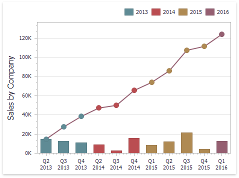
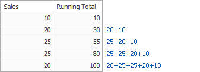
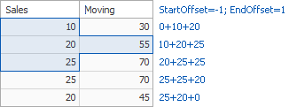
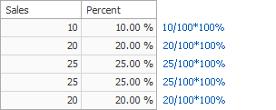

# Window Calculations Overview
Window calculations provide the capability to apply specific computations to measure values and allow you to perform different analytical tasks such as to compute running totals, percentages of totals, differences, etc.

The Dashboard Designer allows you to apply window calculations to values of the specified [measure](../../bind-dashboard-items-to-data/bind-dashboard-items-to-data.md). The following calculation types are supported.
* **Running Total** - Allows you to calculate a cumulative total for a set of measure values.
	
	
* **Moving Calculation** - Allows you to apply a moving calculation, which uses neighboring values to calculate a total. Note that neighboring values are specified using offsets from the currently processed value.
	
	
* **Difference** - Allows you to compute differences between measure values.
	
	
* **Percent of Total** - Allows you to calculate a contribution of individual measure values to a total.
	
	
* **Rank** - Allows you to rank values of the specified measure.
	
	

Note that the computing of calculations depends on two factors.
* The type of the [dashboard item](../../add-dashboard-items.md).
	
	 In this case, you need to specify a calculation _direction_ that depends on the dashboard item type. For instance, the [Pivot](../../dashboard-item-settings/pivot.md) dashboard item provides the capability to apply calculations along with its columns or rows.
* The set of dimensions that are used to calculate measure values.
	
	In this case, a calculation _direction_ depends on the dimensions' order.

In both cases, measure values participating in a calculation fall into a specified _window_. To learn more, see [Window Definition](window-definition.md).

To learn how to create a calculation in the Dashboard Designer, see [Creating Window Calculations](creating-window-calculations.md).