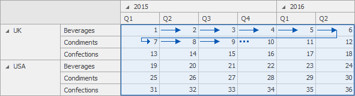
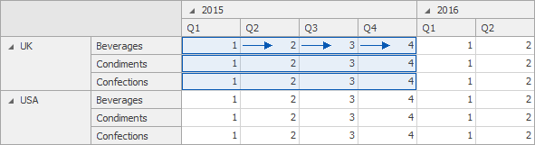

# Window Definition
A _window definition_ specifies a window that limits measure values participating in a calculation. To learn more, see [Window Calculations Overview](../../../../../dashboard-for-desktop/articles/dashboard-designer/data-analysis/window-calculations/window-calculations-overview.md).

## Dashboard Item Window Definition
The following table lists window definitions in terms of the [Pivot](../../../../../dashboard-for-desktop/articles/dashboard-designer/designing-dashboard-items/pivot.md) dashboard item. A calculation is performed using the [Index](../../../../../dashboard-for-desktop/articles/dashboard-designer/data-analysis/window-calculations/calculation-functions-reference.md) function along the following _[directions](../../../../../dashboard-for-desktop/articles/dashboard-designer/data-analysis/window-calculations/window-calculations-overview.md)_.

| Direction | Description | Example | Example Description |
|---|---|---|---|
| Columns | A calculation is performed horizontally through Pivot columns. |  | In this example, a window is a combination of _Country_/_Category_ dimensions. |
| Rows | A calculation is performed vertically through Pivot rows. |  | In this example, a window is a combination of _Year_/_Quarter_ dimensions. |
| Columns / Rows | A calculation is performed horizontally through Pivot columns, then rows. |  | In this example, a window is the entire pivot table. |
| Rows / Columns | A calculation is performed vertically through Pivot rows, then columns. |  | In this example, a window is the entire pivot table. |
| Columns within Groups | A calculation is performed horizontally through Pivot columns within _groups_. |  | In this example, a window is a combination of the _Country_/_Category_ and _Year_ dimensions. |
| Rows within Groups | A calculation is performed vertically through Pivot rows within _groups_. |  | In this example, a window is a combination of the _Year_/_Quarter_ and _Country_ dimensions. |
| Columns / Rows within Groups | A calculation is performed horizontally through Pivot columns then rows within _groups_. |  | In this example, a window is a combination of _Country_/_Year_ dimensions. |
| Rows / Columns within Groups | A calculation is performed vertically through Pivot rows, then columns within _groups_. |  | In this example, a window is a combination of _Country_/_Year_ dimensions. |

_* Group_ - an area that is limited by a set of values corresponding to the bottommost partitioning dimensions.

## Specific Window Definition
If necessary, you can manually specify the set of dimensions that fall into the _window_. These dimensions are called _window dimensions_.

For instance, the [Index](../../../../../dashboard-for-desktop/articles/dashboard-designer/data-analysis/window-calculations/calculation-functions-reference.md) function is applied to measure values of the pivot table below using the _OrderDate (Year)_ and _Country_ window dimensions.

The **Specific Window Definition** dialog allows you to do this.

