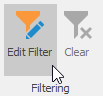
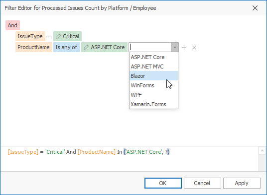
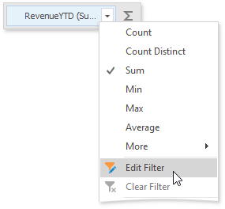
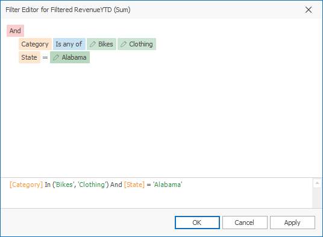
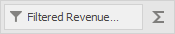
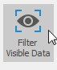
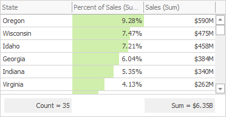
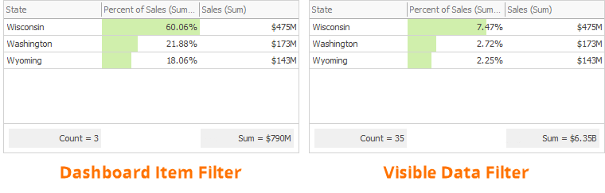

# Filtering
The Dashboard Designer allows you to filter data in the dashboard items or apply filters to a specific measure. [Dimensions](../bind-dashboard-items-to-data/bind-dashboard-items-to-data.md) and [hidden dimensions](../bind-dashboard-items-to-data/hidden-data-items.md) are used to build filter criteria.

## Dashboard Item Filter

Filters that apply to a [dashboard item](../dashboard-item-settings.md) affect only this item. To add filters, select the target dashboard item and do one of the following:

* Click the **Edit Filter** button in the Ribbon menu's **Data** tab. 
	
	
* Right-click a dashboard item and select **Edit Filter** from its context menu.
	
	

This invokes the [Filter Editor](../../../../interface-elements-for-desktop/articles/filter-editor/filter-data-via-the-filter-editor.md) dialog that allows you to build complex filter criteria:

> [!Tip]
> **Documentation**: [Filter Editor](../../../../interface-elements-for-desktop/articles/filter-editor/filter-data-via-the-filter-editor.md) 

To clear the applied filter, select **Clear** from the dashboard item's context menu or click the **Clear** button in the **Data** Ribbon tab.

## Measure Filter

You can apply filters to individual [measures](../bind-dashboard-items-to-data/bind-dashboard-items-to-data.md). If you create multiple measures that only differ in applied filters, you can compare values calculated over different date-time periods or against different categories.

Select a dashboard item and right-click a measure to be filtered. Select **Edit Filter** from its context menu.

This invokes the **Filter Editor** dialog where you can specify filter criteria:

The filtered measure has the _Filter_ icon:

To clear the applied filter, select **Clear** from the measure's context menu.

> [!Note]
> The measure filter is technically an expression that uses the `filter(summaryExpression, filterCriteria)` function, where `summaryExpression` is the measure to be filtered and `filterCriteria` is the filter. See the following topic for more information about functions you can use in dashboard expressions: [Expression Constants, Operators, and Functions](../data-analysis/expression-constants-operators-and-functions.md).

The image below shows a Chart with three measures:  
 
- _2019 - Opened_ is filtered by year 2019.
- _2020 - Opened_ is filtered by year 2020.
- _Opened_ is the original measure without filters.

## Visible Data Filter

You can specify a Visible Data Filter to limit displayed data. This filter type does not filter underlying data used in calculations or intermediate level aggregations.

Click the **Set Visible Data Filter** button in the Ribbon menu's **Data** tab to invoke the Visible Data Filter Editor, where you can set a filter condition:

For example, a Grid dashboard item has 35 rows and displays sales percentages.

The image below shows the difference between filters (the filter condition is the same): 

- **Dashboard Item Filter**: sales percentages are recalculated based on the visible data.
- **Visible Data Filter**: sales percentages remain the same because this filter type does not affect calculations.

## Pass Parameter Values
You can use the Filter Editor to filter a dashboard item according to the current parameter value. See the following topic for details: [Pass Parameter Values](../data-analysis/using-dashboard-parameters/passing-parameter-values.md).

## OLAP Filtering Specifics
You cannot filter data by building complex filter criteria in [OLAP](../bind-dashboard-items-to-data/bind-dashboard-items-to-data-in-olap-mode.md) mode. Instead, select the values you wish to include in or exclude from the dashboard to filter dimension attributes and hierarchies.

For dimension attributes, the Filter Editor contains a list of all values. You can select the values that you wish to display.

For hierarchies, a tree is displayed instead, allowing you to filter individual values at any hierarchy level.

 
