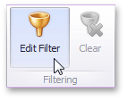
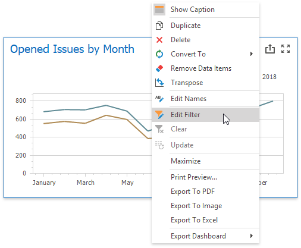
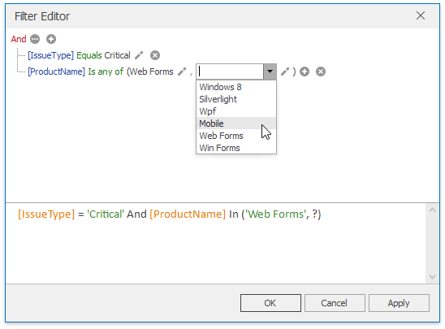
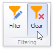

# Filtering
The **Dashboard** allows you to filter a [query](../working-with-data/filter-queries.md) of the [SQL Data Source](../providing-data/connecting-to-sql-databases.md) or apply filtering to a specific data-aware dashboard item.

This topic describes how to enable and reset filtering.

## Apply Filtering
To configure filtering, select the target dashboard item and do one of the following.
* If you are using a Ribbon menu, click the **Edit Filter** button in the **Data** tab.
	
	
* Right-click a dashboard item and select **Edit Filter** from its context menu.
	
	

This will invoke the **Filter Editor** dialog. Use this dialog to build filter criteria with a convenient tree-like interface.

You can use [hidden dimensions](../binding-dashboard-items-to-data/hidden-data-items.md) within the Filter Editor dialog, allowing you to filter data based on their values.

## Clear Filtering
To clear filtering in the Designer, select the target dashboard item and do one of the following.
* If you are using a Ribbon menu, click the **Clear** button in the **Data** tab.
	
	
* Right-click a dashboard item and select **Clear** from its context menu.

## OLAP Filtering Specifics
You cannot apply filtering by building complex filter criteria in [OLAP](../binding-dashboard-items-to-data/binding-dashboard-items-to-data-in-olap-mode.md) mode. Instead, you can filter dimension attributes and hierarchies by manually selecting the values you wish (or do not wish) to include in the dashboard.

For dimension attributes, the Filter Editor contains a list of all values. You can select the values that you wish to display.

For hierarchies, a tree is displayed instead, allowing you to filter individual values at any hierarchy level.

