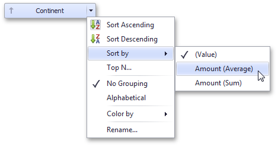
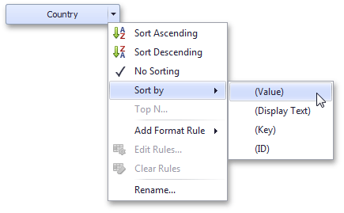

# Sorting
The Dashboard Designer allows you to easily change the sort order of values within a dashboard item. You can also enable sorting by parameter values.
* [Changing Sort Order](#changing-sort-order)
* [Sorting by Measure Values](#sorting-by-measure-values)
* [OLAP Sorting Specifics](#olap-sorting-specifics)

## <a name="changing-sort-order"/>Changing Sort Order
The sort order of dimension values is indicated with an arrow.

To change the sort order in the Designer, click the data item. You can also toggle sorting from the data item menu.

## <a name="sorting-by-measure-values"/>Sorting by Measure Values
Dashboard allows you to sort dimension values by summary values calculated for a specific measure.

To enable sorting by measure in the Designer, use the **Sort by** submenu in the dimension's menu.

You can also sort dimension values by the values of [hidden measures](../bind-dashboard-items-to-data/hidden-data-items.md).

## <a name="olap-sorting-specifics"/>OLAP Sorting Specifics
In [OLAP](../bind-dashboard-items-to-data/bind-dashboard-items-to-data-in-olap-mode.md) mode, you can use the following options to specify the sort order for attribute members.

* **No Sorting** - Specifies the default server sorting for the current attribute.
* **Sort by** - Allows you to choose the OLAP member property by whose values sorting is performed:
	* **(Value)** - sorting is performed by member values;
	* **(Display Text)** - soring is performed by captions associated with members;
	* **(Key)** - sorting is performed by member keys;
	* **(ID)** - sorting is performed by member IDs.