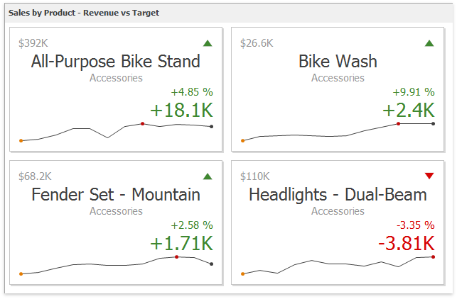

# Cards
The **Card** dashboard item displays a series of cards. Each card illustrates the difference between two values. This difference can be expressed as an absolute value, an absolute variation or a percentage variation.

This section consists of the following subsections:
* [Providing Data](cards/providing-data.md)
	
	Provides information about how to supply the Card dashboard item with data.
* [Layout](cards/layout.md)
	
	Describes how to manage the position and visibility of elements within a card.
* [Delta](cards/delta.md)
	
	Provides an overview of the Card dashboard item's capability to display the difference between two parameters.
* [Sparkline](cards/sparkline.md)
	
	Provides an overview of the Card dashboard item's capability to visualize data using sparklines.
* [Formatting](cards/formatting.md)
	
	Shows how to format values displayed within a card.
* [Interactivity](cards/interactivity.md)
	
	Describes features that enable interaction between a Card dashboard item and other items.
* [Cards Arrangement](cards/cards-arrangement.md)
	
	Describes how to arrange cards within a Card dashboard item.
* [Conditional Formatting](cards/conditional-formatting.md)	

	Describes how to format a Card dashboard item’s elements when its values meet a specified condition.	
