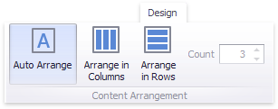
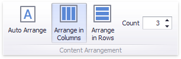
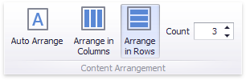

# Cards Arrangement
The **Card** dashboard item allows you to specify the number of columns or rows in which individual cards are arranged.

Use the buttons in the **Content Arrangement** group of the **Design** Ribbon tab to control how cards are arranged.

The **Auto Arrange** option is enabled by default, which automatically resizes cards to fit within the dashboard item.

You can also specify the number of columns in which cards are arranged. Click the **Arrange in Columns** button and specify the appropriate number in the **Count** field.

Similarly, you can arrange cards in a specific number of rows.

