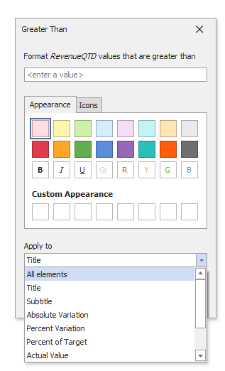

# Conditional Formatting

For the Card dashboard item, you can apply conditional formatting to the card's visual elements (like Title, Subtitle, different values) and change the card's background.

> [!Note]
> Cards that use a [legacy layout](https://docs.devexpress.com/Dashboard/113798/create-dashboards/create-dashboards-in-the-winforms-designer/designing-dashboard-items/cards/layout#legacy-layout-v162-and-earlier) do not support conditional formatting.

## Create a Format Rule

You can create format rules in the following ways:

* Click the **Edit Rules** button in the **Home** ribbon tab.

   

   The invoked dialog contains the **calculated by** combo box where you can select the item whose values are used to calculate the format rule. 
    
   * To apply a format rule to a specific card, calculate a format rule by delta values. The [expression](../../appearance-customization/conditional-formatting/expression.md) format condition is an exception to this rule and applies to all cards.
   * To apply a format rule to all cards in the Card item, calculate a rule by hidden measures and series dimensions.

   For the Card item, the dialog has the **using** combo box. Use it to specify the delta type if you calculate a condition by delta. Click the **Add** button, select the format rule from the pop-up menu, and specify the rule's condition:

   

* click the series dimension/hidden measure menu button.

    

## Appearance Settings   

Specify appearance settings and set the condition's value for the format rule. Available settings depend on the selected format rule. 

The appearance settings dialog contains the **Apply to** drop-down list. Select a [layout element](layout.md) to which you want to apply a format rule. Select _All elements_ to apply the format rule to all card elements. 

The image below displays the Greater Than dialog corresponding to the Value format condition. 

A background color applies to the entire card. In this case, the **Apply to** drop-down list is not in effect.

 Some of the predefined background styles contain a font color. This font color applies to all the card's elements regardless of the drop-down list settings (all/particular element).

## Edit a Format Rule

To edit format rules for the current Card dashboard item, use the following options.
* Click the **Edit Rules** button in the **Home** ribbon tab or use corresponding item in the Card context menu.
* Click the [menu button](../../ui-elements/data-items-pane.md) for the required data item and select **Edit Rules**.

All of these actions invoke the **Edit Rules** dialog that contains existing format rules. For more information, see [Conditional Formatting](../../appearance-customization/conditional-formatting.md).
