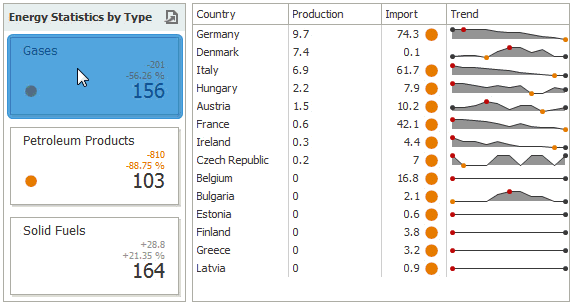

# Master Filtering
The **Dashboard** allows you to use any data aware dashboard item as a filter for other dashboard items (**Master Filter**). To learn more about filtering concepts common to all dashboard items, see the [Master Filtering](../../../interactivity/master-filtering.md) topic.

When Master Filtering is enabled, you can click a card (or multiple cards by holding down the **CTRL** key) to make other dashboard items only display data related to the selected card(s).

To learn how to enable Master Filtering in the Designer, see the [Master Filtering](../../../interactivity/master-filtering.md) topic.

To reset filtering, use the **Clear Master Filter** button (the  icon) in the [caption](../../../dashboard-layout/dashboard-item-caption.md) of the Card dashboard item, or the **Clear Master Filter** command in the Card's context menu.

