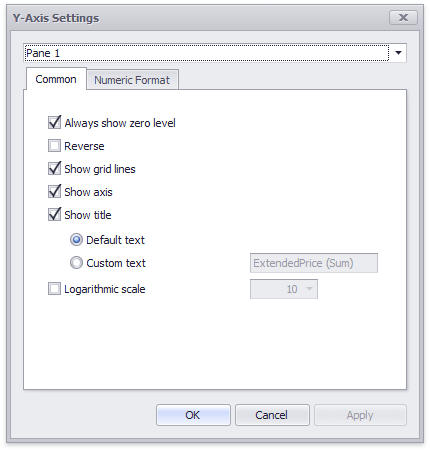
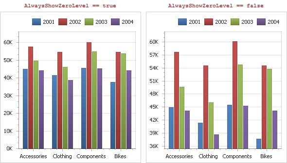

# Y-Axis
The **Y-axis** is the numerical axis of values.

## General Settings
To access the Y-axis settings, use the **Y-Axis Settings** button in the **Diagram** section of the **Design** Ribbon tab.

This will invoke the **Y-Axis Settings** dialog.

Use the combo box at the top to select the [pane](../panes.md) for the Y-axis settings you need to edit.

The dialog contains the following settings.
* **Always show zero level** - Specifies whether or not the axis' zero level is visible. If this option is unchecked, the visible axis range is defined based on the values plotted in the chart. 
	
	
* **Reverse** - Allows you to reverse the X-axis. If the X-axis is reversed, its values are ordered from top to down.
* **Show grid lines** - Allows you to hide and show grid lines for the Y-axis.
* **Show Y-axis** - Allows you to hide and show the Y-axis.
* **Show title** - Allows you to hide and show the Y-axis title. You can choose whether to use the default text or specify a custom string.