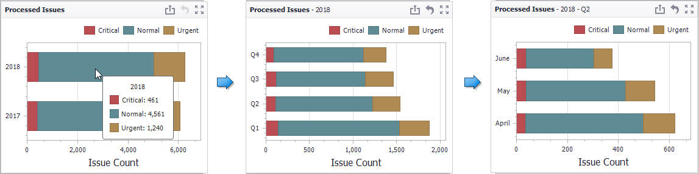
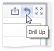

# Drill-Down
The built-in drill-down capability allows you to change the detail level of data displayed in dashboard items on the fly. To learn more about drill-down concepts common to all dashboard items, see the [Drill-Down](../../../interactivity/drill-down.md) topic.

The Chart dashboard item supports drill down on argument or series values.

## Drill Down on an Argument
When drill down on arguments is enabled, you can click a series point to view a detail chart for the corresponding argument value.

> [!NOTE]
> When [Filtering by Arguments](master-filtering.md) is enabled, you can view the details by double-clicking a series point.

Drill down on arguments requires that the Arguments section contains several data items, from the least detailed to the most detailed item.

> [!NOTE]
> In OLAP mode, you can perform drill-down for either a hierarchy data item or several dimension attributes.

To enable drill down on arguments, click the **Drill Down** button in the **Data** Ribbon tab (or the  button if you are using the toolbar menu)...

...and the **Arguments** button (or the  button if you are using the toolbar menu).

## Drill Down on a Series
When drill down on a series is enabled, you can click a series point (or corresponding legend item) to view a detail chart for the corresponding series.

> [!NOTE]
> When [Filtering by Series](master-filtering.md) is enabled, you can view the details by double-clicking a series point.

Drill down on a series requires that the Series section contains several data items, from the least detailed to the most detailed item.

> [!NOTE]
> In OLAP mode, you can perform drill-down for either a hierarchy data item or several dimension attributes.

To enable drill down on a series, click the **Drill Down** button in the **Data** Ribbon tab (or the  button if you are using the toolbar menu)...

...and the **Series** button (or the  button if you are using the toolbar menu).

## Drill Up
To return to the previous detail level (drill up), use the **Drill Up** button within the Chart [caption](../../../dashboard-layout/dashboard-item-caption.md) or in the context menu.

