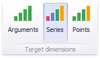
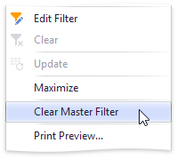

# Master Filtering
The **Dashboard** allows you to use any data aware dashboard item as a filter for other dashboard items (**Master Filter**). To learn more, see the [Master Filtering](../../../interactivity/master-filtering.md) topic, which describes filtering concepts common to all dashboard items.

The Chart dashboard item supports filtering by **argument**, **series** or **points**.

## Filtering by Arguments
When filtering by arguments is enabled, you can click series points to make other dashboard items only display data related to selected argument values.

To enable filtering by arguments in the Designer, set the required [Master Filter mode](../../../interactivity/master-filtering.md) and click the **Arguments** button in the **Data** Ribbon tab (or the  button if you are using the toolbar menu).

## Filtering by Series
When filtering by series is enabled, you can click a series point to make other dashboard items only display data related to the selected series.

To enable filtering by series in the Designer, set the required [Master Filter mode](../../../interactivity/master-filtering.md) and click the **Series** button in the **Data** Ribbon tab (or the  button if you are using the toolbar menu).

## Filtering by Points
When filtering by points is enabled, you can click a individual point to make other dashboard items display only data related to the selected point.

To enable filtering by points in the Designer, set the required [Master Filter mode](../../../interactivity/master-filtering.md) and click the **Points** button in the **Data** Ribbon tab.

## Reset Filtering
To reset filtering, use the **Clear Master Filter** button in the Chart's [caption](../../../dashboard-layout/dashboard-item-caption.md) area…

…or the corresponding command in the Chart's context menu.

