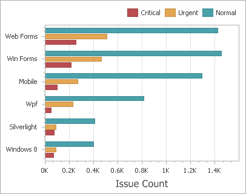
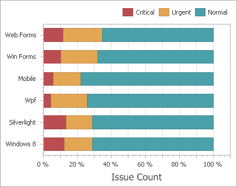

# Bar Series
Bar series visualize data using rectangular bars with lengths proportional to the values that they represent.

The following types of Bar series are available.
* [Bar](#bar)
* [Stacked Bar](#stacked-bar)
* [Full-Stacked Bar](#full-stacked-bar)

## <a name="bar"/>Bar
Bar series can be used to compare values across categories.

## <a name="stacked-bar"/>Stacked Bar
Stacked Bar series show the contribution of individual categories to the whole.

## <a name="full-stacked-bar"/>Full-Stacked Bar
Full-Stacked Bar series allow you to compare the percentage that each value contributes to a total across categories.

