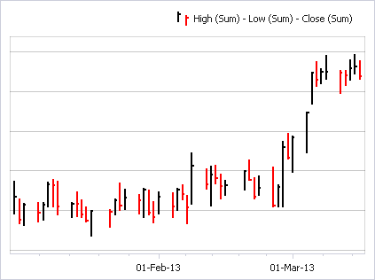
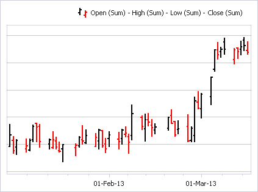
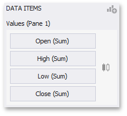

# Financial Series
Financial series are used to illustrate stock prices.

The following types of Financial series are available.
* [High-Low-Close](#high-low-close)
* [Stock](#stock)
* [Candle Stick](#candle-stick)

## Coloring Specifics
Note that financial series do not support a standard [coloring](../../../appearance-customization/coloring.md) mechanism used to color chart series points. The Chart dashboard item colors series points of financial series in the following way.
* **Black** if the price at the end of the previous period is lower than the price at the end of the current period.
* **Red** if the price at the end of the previous period is larger than the price at the end of the current period.

## <a name="high-low-close"/>High-Low-Close
When you select the High-Low-Close series type in the Designer, the [DATA ITEMS](../../../ui-elements/data-items-pane.md) area displays three data item placeholders. High-Low-Close series require three measures to be provided.

* **High** - the maximum price within the specified period (the top of the series point).
* **Low** - the minimum price within the specified period (the bottom of the series point).
* **Close** - the price at the end of the specified period (the tick mark).

## <a name="stock"/>Stock
When you select the Stock series type in the Designer, the [DATA ITEMS](../../../ui-elements/data-items-pane.md) area displays four data item placeholders. Stock series require four measures to be provided.

* **Open** - the price at the beginning of the specified period (the left tick mark).
* **High** - the maximum price within the specified period (the top of the series point).
* **Low** - the minimum price within the specified period (the bottom of the series point).
* **Close** - the price at the end of the specified period (the right tick mark).

## <a name="candle-stick"/>Candle Stick
When you select the Candle Stick series type in the Designer, the [DATA ITEMS](../../../ui-elements/data-items-pane.md) area displays four data item placeholders. Candle Stick series require four measures to be provided.

* **Open** - the price at the beginning of the specified period.
* **High** - the maximum price within the specified period (the upper shadow top).
* **Low** - the minimum price within the specified period (the lower shadow bottom).
* **Close** - the price at the end of the specified period.

