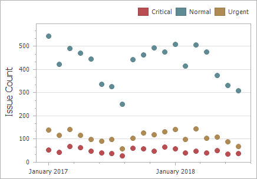
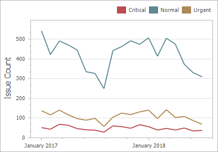
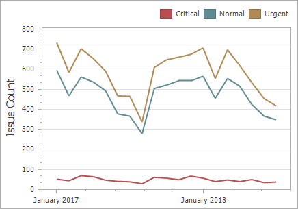
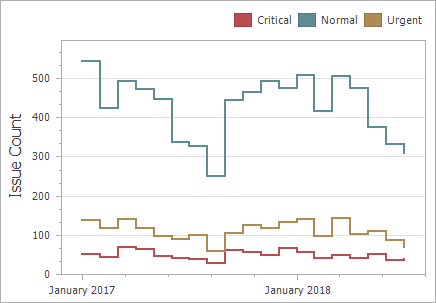

# Point and Line Series
Point series visualize data as a set of individual numeric data points. Line series are used to connect numeric data points by different types of line segments.

The following types of Point and Line series are available.
* [Point](#point)
* [Line](#line)
* [Stacked Line](#stacked-line)
* [Full-Stacked Line](#full-stacked-line)
* [Step Line](#step-line)
* [Spline](#spline)

## <a name="point"/>Point
Point series visualize data as a set of individual numeric data points.

## <a name="line"/>Line
Line series connect numeric data points by straight line segments.

## <a name="stacked-line"/>Stacked Line
Stacked Line series can be used to show the trend of the contribution for each value.

## <a name="full-stacked-line"/>Full-Stacked Line
Stacked Line series are useful for showing the trend of the percentage for each value.

## <a name="step-line"/>Step Line
Step Line series use vertical and horizontal lines to connect the numeric data points forming a step-like progression.

## <a name="spline"/>Spline
Spline series plot a fitted curve through each numeric data point.

