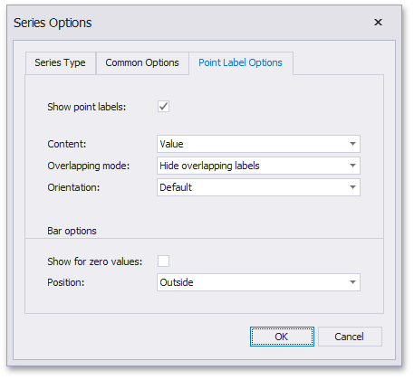

# Series Overview
The Chart dashboard item supports a variety of series types - from simple bar and line charts to complex candle stick and bubble graphs.
* [Bar Series](../../../../../../dashboard-for-desktop/articles/dashboard-designer/designing-dashboard-items/chart/series/bar-series.md)
* [Point and Line Series](../../../../../../dashboard-for-desktop/articles/dashboard-designer/designing-dashboard-items/chart/series/point-and-line-series.md)
* [Area Series](../../../../../../dashboard-for-desktop/articles/dashboard-designer/designing-dashboard-items/chart/series/area-series.md)
* [Range Series](../../../../../../dashboard-for-desktop/articles/dashboard-designer/designing-dashboard-items/chart/series/range-series.md)
* [Weighted Series](../../../../../../dashboard-for-desktop/articles/dashboard-designer/designing-dashboard-items/chart/series/weighted-series.md)
* [Financial Series](../../../../../../dashboard-for-desktop/articles/dashboard-designer/designing-dashboard-items/chart/series/financial-series.md)

This topic describes how to change the series type and specify various series options (for instance, how to use secondary axis or enable point labels).
* [Series Types](#series-types)
* [Series Options](#series-options)
* [Series Point Labels](#series-point-labels)

## <a name="series-types"/>Series Types
To switch between series types in the Dashboard Designer, click the **Options** button next to the required [data item](../../../../../../dashboard-for-desktop/articles/dashboard-designer/ui-elements/data-items-pane.md) (or placeholder) in the **Values** section.

In the invoked **Series Options** dialog, select the required series type and click **OK**.

You can also do this using the **Series Type** gallery in the **Design** Ribbon tab.

## <a name="series-options"/>Series Options
To manage common series options, use the **Common Options** tab of the **Series Options** dialog.

* **Plot on secondary axis** - Specifies whether or not the secondary axis is used to plot the current series.
* **Ignore empty points** - Specifies whether or not empty points are ignored when plotting the current series.
	
	Note that this option is in effect for the [Line](../../../../../../dashboard-for-desktop/articles/dashboard-designer/designing-dashboard-items/chart/series/point-and-line-series.md), [Area](../../../../../../dashboard-for-desktop/articles/dashboard-designer/designing-dashboard-items/chart/series/area-series.md) and [Range Area](../../../../../../dashboard-for-desktop/articles/dashboard-designer/designing-dashboard-items/chart/series/range-series.md) series.
* **Show point markers** - Specifies whether or not to show point markers for the current series.
	
	> Note that point markers are always shown when [Master Filtering](../../../../../../dashboard-for-desktop/articles/dashboard-designer/interactivity/master-filtering.md) is enabled for the Chart dashboard item.
	
	Note that this option is in effect for the [Line](../../../../../../dashboard-for-desktop/articles/dashboard-designer/designing-dashboard-items/chart/series/point-and-line-series.md) and [Area](../../../../../../dashboard-for-desktop/articles/dashboard-designer/designing-dashboard-items/chart/series/area-series.md) series.

## <a name="series-point-labels"/>Series Point Labels
The **Point Label Options** tab of the **Series Options** dialog allows you to enable series point labels and manage their settings.

* **Show point labels** - Specifies whether or not to show point labels for the current series.
* **Content** - Specifies the type of content displayed within point labels.
* **Overlapping mode** - Specifies the label overlap mode.
	
	> This option is not in effect when the dashboard is displayed in the Web Viewer.
* **Orientation** - Specifies the orientation of point labels.

**Bar options**

> These settings are in effect for [Bar](../../../../../../dashboard-for-desktop/articles/dashboard-designer/designing-dashboard-items/chart/series/bar-series.md) series only.

* **Show for zero values** - Specifies whether or not to show labels for points with zero values.
* **Position** - Specifies the position of point labels relative to bars.