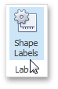
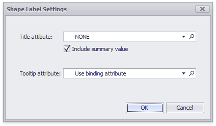

# Labels
A Choropleth map provides the capability to display titles within map shapes and allows you to manage what data to show in the shape tooltips.

To manage map titles and tooltips, click the **Shape Labels** button in the **Design** ribbon tab.

This invokes the **Shape Label Settings** dialog.

In this dialog, you can specify attributes whose values will be displayed within shapes and tooltips. Use the  button to preview the available attributes and their values for the current map.

## Shape Titles
The **Title attribute** option allows you to select the attribute whose values are displayed within corresponding map shapes.

You can also use the **Include summary value** option to add summary values to shape titles.

## Tooltips
The **Choropleth Map** dashboard item displays a tooltip that shows information related to a hovered shape.

You can choose whether to use a [binding attribute](providing-data.md) to display as the title of shape tooltips (the **Use binding attribute** option) or specify a custom attribute using the **Tooltip attribute** option.

The Choropleth Map also allows you to add supplementary content to the tooltips using the TOOLTIP DATA ITEMS area. To learn more, see the [Providing Data](providing-data.md) topic.