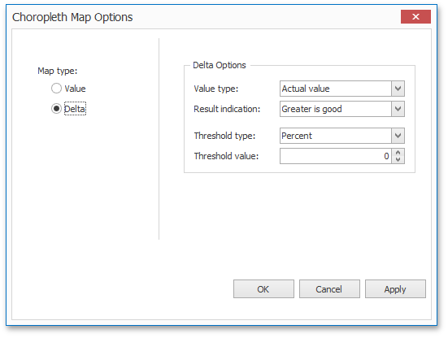
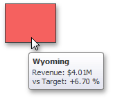

# Delta
The **Choropleth Map** allows you to indicate the difference between the _actual_ and _target_ values of a particular parameter. This difference is called **delta**.

## Delta Options
To specify delta indication settings, click the **Options** button next to the data item container.

This invokes the **Choropleth Map Options** dialog. When the map type is set to **Delta**, this dialog contains the following settings.

* **Value Type**
	
	You can specify which values to display within map tooltips. Use the **Value type** combo box to select the value that will be displayed as the delta value.
	
	| Value Type | Tooltip |
	|---|---|
	| **Actual value** |  |
	| **Absolute variation** |  |
	| **Percent variation** |  |
	| **Percent of target** |  |
* **Result Indication**
	
	You can specify the condition that will be used to select the indicator color. To do this, use the **Result indication** combo box.
	
	| Result Indication | Area Color |
	|---|---|
	| **Greater is good** |  |
	| **Less is good** |  |
	| **Warning if greater** |  |
	| **Warning if less** |  |
	| **No indication** |  |
* **Threshold type** and **Threshold value**
	
	You can specify that a required indicator should only be displayed when the difference between the actual and target values exceeds a specified value. For instance, the actual value exceeds the target value by 10%, or by $2K.
	
	Use the **Threshold type** combo box to select whether you wish to specify the threshold in percentage values or in absolute values. Then use the **Threshold value** box to specify the threshold value.