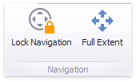

# Map Navigation
The Choropleth Map dashboard item allows you to perform navigation actions such as zooming and scrolling.

The Dashboard Designer allows you to specify the initial zooming/scrolling state for the Choropleth map using the mouse.

You can disable the capability to scroll/zoom the map using the **Lock Navigation** button in the **Design** ribbon tab.

Use the **Full Extent** button to display the entire map within the dashboard item.