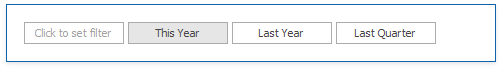

# Date Filter

The **Date Filter** dashboard item allows you to filter dashboard data based on the selected data range. The range can be relative (Last 3 Months), use fixed dates (01-01-2018), or presets (Month-to-date). You can also filter dates before or after a specified date. 

The DateFilter item displays a set of intervals that can be used as quick filters. 

End-users can click the button to invoke the Date Picker:

## Add a New Date Filter to the Dashboard

To create a Date Filter item, click the **Filter Elements** drop-down button in the **Insert** group on the **Home** ribbon page and select **Date Filter**.

## Bind to Data

Use the **Data Items Pane** to perform data binding. Drag the dimension field from the [Data Source Browser](../ui-elements/data-source-browser.md) to the data item, and click the _Options_ button to select [group intervals](../data-shaping/formatting-data.md).

## Filter Type

A filter can be a DateTime value, DateTime range or infinite interval before or after a specified date.

To specify the filter type, click the drop-down **Filter Type** in the ribbon (Date Filter Tools contextual tab-> Design page -> Layout group):

## Date Picker

The DateFilter item contains a Date Picker - a button with a drop-down calendar. This button initially displays "Click to set filter".

The calendar drops down when the end user:

* clicks the button without a specified range (the button with the "Click to set filter" caption)
* clicks the  icon on the button with the specified datetime range.

A drop-down calendar may contain a single calendar control (the Filter Type is Exact, Before or After) or two calendar controls (the Filter Type is Between).

When the user selects the date, the Date Picker caption displays information about that date (date range) and the  icon. The caption text is constructed from a custom string with date placeholders. If the user clicks the caption, The Date Picker button acts as a checked button to apply the date range (checked) or reset the date filter (unchecked) to its default value. When the user clicks the icon, the drop-down calendar appears and enables the user to select another date range. 

To show or hide the Date Picker component, click the **Show Date Picker** check button in the ribbon (Date Filter Tools contextual tab-> Design page -> Layout group):

## Display Format

To specify the date-time value format, use the **Format** submenu in the data item menu, as described in the [Formatting Data](../data-shaping/formatting-data.md) topic.

To specify a custom string displayed in the Date Picker component, use the **Edit Names** dialog. To invoke the dialog, right-click the DateFilter item and click the Edit Names... menu item or click the **Edit Names** button in the **Design** Ribbon tab.

You can include placeholders in a custom string. The {0} placeholder is the interval's start, the {1} placeholder is the interval's end.

## Create Quick Filters

Quick Filters are buttons displayed within the DateFilter item. Each button has a DateTime range assigned to it. You can click the button to apply that range as a Date filter. The button is checked until the end-user clicks the same button once more to reset the filter to its default value. The buttom becomes unchecked if the end user clicks another button.

The item's context menu contains commands with the same captions that act as quick filters.

A newly created DateFilter dashboard item has no quick filters. To add a quick filter:

* in the dashboard designer, click the _[Options](../ui-elements/data-items-pane.md)_ button (the  icon) next to the _Argument_ placeholder
* or select the _Edit Periods_ command in the context menu
* or click the **Edit Periods** in the ribbon (Date Filter Tools contextual tab-> Design page -> Interactivity group):

    

This invokes the **Edit Periods** dialog. You can select a [predefined range](range-filter/predefined-ranges.md) or add a custom period, specify the quick filter's range and caption.

## Arrange Quick Filters

Quick filters in the DateFilter item can be arranged horizontally or vertically. The default mode is _auto height_, in which quick filters are displayed horizontally and the dashboard item shrinks automatically to fit the items and save space.

To specify the arrangement mode, click the **Arrangement Mode** drop-down in the ribbon (Date Filter Tools contextual tab-> Design page -> Layout group):

Auto Height Arrangement Mode:

Vertical Arrangement Mode:

Horizontal Arrangement Mode:

