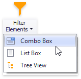
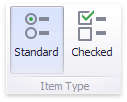
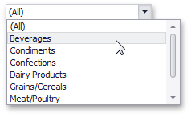
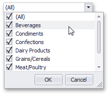
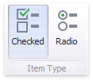
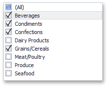
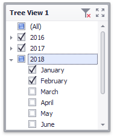
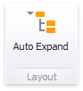
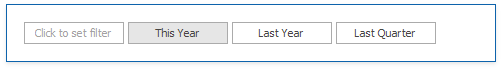

# Filter Elements Overview
The **Dashboard Designer** allows you to create filter elements that used to filter other dashboard items.
* [Combo Box](#combo-box)
* [List Box](#list-box)
* [Tree View](#tree-view)
* [Date Filter](#date-filter)

To add the required filter element to the dashboard, use the **Filter Elements** button in the **Home** ribbon tab.

## Combo Box
The **Combo Box** dashboard item allows you to select a value(s) from the drop-down list.

You can switch the combo box type in the ribbon **Design** tab.

| Combo Box Type | Example | Description |
|---|---|---|
| **Standard** |  | Allows yous to select only a single value. |
| **Checked** |  | Allows you to select multiple values in the invoked drop-down list. |

## List Box
The **List Box** dashboard item allows you to select a value(s) from the list.

You can switch the list box type in the ribbon **Design** tab.

| List  Box Type | Example | Description |
|---|---|---|
| **Checked** |  | Allows you to select multiple values in the list box. |
| **Radio** |  | Allows you to select only a single value in the radio group. |

## Tree View
The **Tree View** dashboard item displays values in a hierarchical way and allows you to expand/collapse nodes.

You can manage the initial expanded state of filter values using the **Auto Expand** button in the **Design** ribbon tab.

## Date Filter

The **Date Filter** dashboard item allows you to filter dashboard data based on the selected data range. The range can be relative (Last 3 Months), use fixed dates (01-01-2018), or presets (Month-to-date). You can also filter dates before or after a specified date. 

The DateFilter item displays a set of intervals that can be used as quick filters. 

See [Date Filter](../date-filter.md) for details.