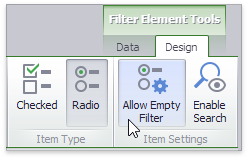

# Interactivity
This document describes the filtering capabilities supported by filter elements. You can use filter elements to apply master filtering to other dashboard items or introduce hierarchical filtering by adding several connected filters.

## Master Filtering
The **Dashboard** allows you to use any data aware dashboard item as a filter for other dashboard items (**Master Filter**). To learn more, see the [Master Filtering](../../interactivity/master-filtering.md) topic, which describes filtering concepts common to all dashboard items.

> Note that filter elements do not support Master Filter selection modes. You can switch the selection mode by [changing the type](filter-elements-overview.md) of the required filter element.

Depending on the filter element type, you can select a value(s) to make other dashboard items display only data related to the selected value(s).

You can also create a set of related filter elements containing relevant filter values. For instance, in the image below, the **State/Province** filter element contains states related to the 'United States' value, while the **City** filter element contains cities related to the 'New York' value.

Disable the **Ignore Master Filters** option for the required filter element to allow applying filtering to this element.

## Filter Element Options
Filter elements provide the capability to specify whether to enable the _(All)_ option that allows you to apply filtering by all values. To do this, use the **Show 'All' Value** button in the **Design** ribbon tab.

Note that this capability is supported by the 'Standard' Combo Box and 'Radio' List Box filter elements.