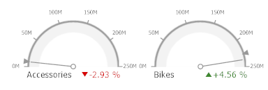
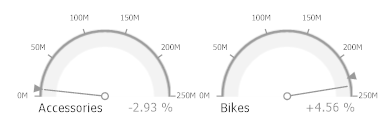
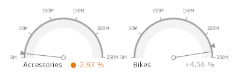

# Delta
Gauges allow you to display the difference between the _actual_ and _target_ values of a particular parameter. This difference is called **delta**.

Delta is shown with a _delta indicator_ (indicating whether the actual value is less than or greater than the target value) and _delta values_ (representing this difference as an absolute value or a variation).

To customize settings that relate to the calculation and display of deltas, use the options buttons (the  icon) displayed next to the data item container in the Gauges section of the DATA ITEMS pane.

These buttons invoke the **Gauge Options** dialog.

Use it to define the condition for displaying delta indication, specify which delta values should be displayed, and introduce the comparison tolerance.
* [Delta Values](#deltavalues)
* [Delta Indication](#deltaindicationcondition)
* [Comparison Tolerance](#comparisontolerance)

## <a name="deltavalues"/>Delta Values
You can specify which values should be displayed within gauges. Use the **Value type** combo box in the **Gauge Options** window to select the value that will be displayed as the delta value.

| Value Type | Result |
|---|---|
| Actual Value |  |
| Absolute Variation |  |
| Percentage Variation |  |
| Percentage of Target |  |

## <a name="deltaindicationcondition"/>Delta Indication
You can specify the condition for displaying delta indication. To do this, use the **Result indication** combo box in the **Gauge Options** window.
* Greater is Good - The 'good' indication is displayed if the actual value exceeds the target value; if the target value exceeds the actual value, the 'bad' indication is displayed. 
	
	
* Less is Good - The 'bad' indication is displayed if the actual value exceeds the target value; if the target value exceeds the actual value, the 'good' indication is displayed. 
	
	
* No Indication - Indication is not displayed. 
	
	
* Warning if Greater - A warning is displayed if the actual value exceeds the target value; otherwise, no indication is displayed. 
	
	
* Warning if Less - A warning is displayed if the target value exceeds the actual value; otherwise, no indication is displayed. 
	
	

## <a name="comparisontolerance"/>Comparison Tolerance
The comparison tolerance allows you to create more advanced conditions for displaying delta indication. For instance, you can specify that a specific indication should be displayed when the actual value exceeds the target value _by 10%_ or _by $2K_.

Use the **Threshold type** combo box to select whether you wish to specify the comparison tolerance in percentage values or in absolute values. Then use the **Threshold value** box to specify the comparison tolerance.