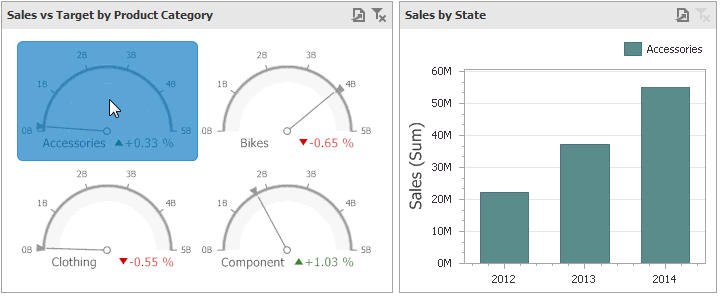

The **Dashboard** allows you to use any data aware dashboard item as a filter for other dashboard items (**Master Filter**). To learn more about filtering concepts common to all dashboard items, see the [Master Filtering](../../../../../../dashboard-for-desktop/articles/dashboard-designer/interactivity/master-filtering.md) topic.

When master filtering is enabled, you can click a gauge (or multiple gauges by holding down the **CTRL** key) to make other dashboard items only display data related to the selected gauge(s).

To learn how to enable master filtering in the Designer, see the [Master Filtering](../../../../../../dashboard-for-desktop/articles/dashboard-designer/interactivity/master-filtering.md) topic.

To reset filtering, use the **Clear Master Filter** button (the  icon) in the [caption](../../../../../../dashboard-for-desktop/articles/dashboard-designer/dashboard-layout/dashboard-item-caption.md) of the Gauge dashboard item, or the **Clear Master Filter** command in the Gauge’s context menu.