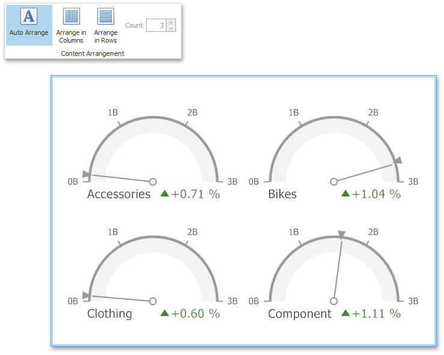
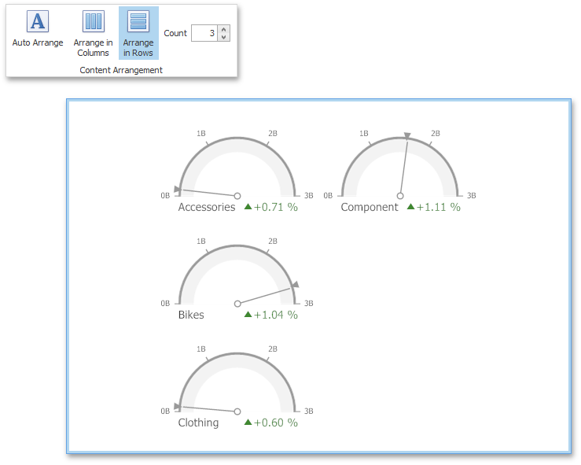

# Layout
The **Gauge** dashboard item allows you to specify the number of columns or rows in which individual gauges are arranged.

To control how gauges are arranged, use the buttons in the **Content Arrangement** group of the **Design** Ribbon tab.

By default, the **Auto Arrange** option is enabled, which automatically resizes gauges to fit within the dashboard item.

You can also specify the number of columns in which gauges are arranged. Click the **Arrange in Columns** button and specify the appropriate number in the **Count** field.

Similarly, you can arrange pies in a specific number of rows by clicking the **Arrange in Rows** button.

