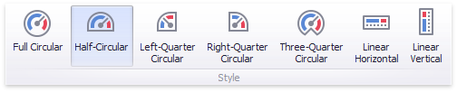

# Style
The **Gauge** dashboard item allows you to select the gauge type.

The following types are supported.

**Full Circular:**

**Half Circular:**

**Left-Quarter Circular:**

**Right-Quarter Circular:**

**Three-Fourths Circular**

**Linear Horizontal:**

**Linear Vertical:**

To select the gauge type, use the buttons in the **Style** group of the **Design** Ribbon tab.

