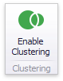

# Clustering
When a **Geo Point** map contains a large number of objects (callouts, bubbles or pies), showing each object individually on the map is not useful. The **Dashboard Designer** provides the capability to group neighboring map objects. This feature is called **Clustering**.

For instance, the **Geo Point Map** dashboard item combines callouts to bubbles.

The **Bubble Map**  and **Pie Map** dashboard items cluster bubbles/pies with other bubbles/pies.

To enable clustering in the Designer, use the **Enable Clustering** button in the **Data** ribbon tab.

