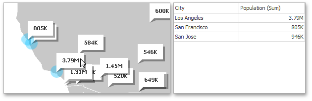

This document describes the **Master Filtering** capability, which enables interaction between the **Geo Point Map** and other dashboard items.

## Master Filtering
The **Dashboard** allows you to use any data aware dashboard item as a filter for other dashboard items (**Master Filter**). To learn more about the filtering concepts common to all dashboard items, see the [Master Filtering](../../../../../dashboard-for-desktop/articles/dashboard-designer/interactivity/master-filtering.md) topic.

When Master Filtering is enabled, you can click a callout/bubble/pie (or multiple callouts/bubbles/pies by holding down the **CTRL** key) to make other dashboard items only display data related to the selected callout(s)/bubble(s)/pie(s).

> When you select a [clustered](../../../../../dashboard-for-desktop/articles/dashboard-designer/designing-dashboard-items/geo-point-maps/clustering.md) bubble or pie, master filtering is applied by all points that are clustered into this bubble/pie.

To learn how to enable Master Filtering in the Designer, see the [Master Filtering](../../../../../dashboard-for-desktop/articles/dashboard-designer/interactivity/master-filtering.md) topic.

To reset filtering, use the **Clear Master Filter** button (the  icon) in the map's [caption](../../../../../dashboard-for-desktop/articles/dashboard-designer/dashboard-layout/dashboard-item-caption.md), or the **Clear Master Filter** command in the context menu.

