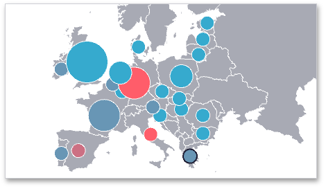
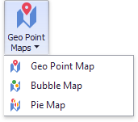

# Map Types Overview
The **Dashboard Designer** allows you to create three types of **Geo Point** maps.
* The **[Geo Point Map](geo-point-map.md)** dashboard item allows you to place callouts on the map using geographical coordinates.
	
	
* The **[Bubble Map](bubble-map.md)** dashboard item allows you to place bubbles on the map. Each bubble can represent data using its weight and color.
	
	
* The **[Pie Map](pie-map.md)** dashboard item allows you to display pies on the map. Each pie visualizes the contribution of each value to the total. 
	
	

To create the required **Geo Point Map** dashboard item, use the **Geo Point Maps** button in the **Home** ribbon tab.

To learn more about common capabilities of all Geo Point map types, see the following topics.
* [Providing Maps](providing-maps.md)
	
	Explains how to use default dashboard maps or provide custom maps.
* [Clustering](clustering.md)
	
	Describes the feature that enables grouping of neighboring map objects.
* [Interactivity](interactivity.md)
	
	Describes features that enable interaction between the Geo Point maps and other dashboard items.
* [Labels](labels.md)
	
	Describes how to display additional information related to map shapes.
* [Map Navigation](map-navigation.md)
	
	Explains how to manage map zooming and scrolling.