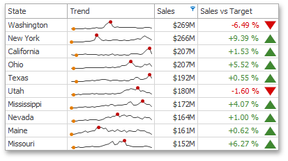

# Grid
The topics in this section describe the features available in the **Grid** dashboard item, and provide extensive information on how to create and customize grids in the **Dashboard Designer**.

This section consists of the following subsections.
* [Providing Data](grid/providing-data.md)
	
	Provides information about how to supply the Grid dashboard item with data.
* [Columns](grid/columns.md)
	
	Describes different types of grid columns.
* [Interactivity](grid/interactivity.md)
	
	Describes features that imply interaction between the Grid and other dashboard items.
* [Conditional Formatting](grid/conditional-formatting.md)
	
	Describes the conditional formatting feature that provides the capability to apply formatting to grid cells whose values meet the specified condition.
* [Totals](grid/totals.md)
	
	Describes totals that allow you to calculate summaries against values displayed within Grid columns.
* [Layout](grid/layout.md)
	
	Describes the Grid's layout options.
* [Style](grid/style.md)
	
	Describes the Grid's style settings.