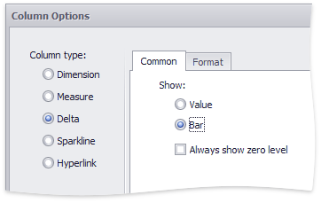

# Delta Column
A **delta column** calculates summaries against two measures, and displays the difference between these summaries. This difference can be indicated with a numeric value displayed within the delta element and an additional delta indication.

## Data Binding Specifics
Delta columns are bound to two measures that provide two values: the **Actual** value and the **Target** value. The difference between these values is displayed in the column.

When you switch the column type to **Delta**, the data item container is changed, to accept the Actual and Target measures.

## Display Mode
Values in the delta column can be displayed as text, or represented by bars.

To select between these modes, invoke the **Column Options** window (see the [Column Type Overview](column-type-overview.md) topic to learn how to do this) and select **Value** or **Bar**.

If bars are displayed, use the **Always show zero level** check box to specify whether the bar's minimum value is zero (checked) or an automatically selected value that ensures that the difference between bars is clearly displayed (unchecked).

## Delta Values and Indication
If the display type is set to **Value**, the **Column Options** window displays options that allow you to configure delta values and indication.

You can specify which values should be displayed in the delta column. To do this, use the **Value type** combo box in the **Column Options** window.

| Actual value | Absolute variation | Percent variation | Percent of target |
|---|---|---|---|
|  |  |  |  |

To specify the condition for displaying delta indication, use the **Result indication** combo box in the **Column Options** window.

| Greater is good | Less is good | Warning if greater | Warning if less | No indication |
|---|---|---|---|---|
|  |  |  |  |  |

The **Format** tab allows you to specify the numeric display format for different value types, as described in the [Formatting Data](../../../data-shaping/formatting-data.md) document. 

The tab contains the following settings.

* **Format type** - Specifies format types for numeric values. 
* **Unit** - Specifies the unit to convert the numeric values.
* **Precision** - Specifies the number of fractional digits to display.
* **Currency** - Specifies the currency symbol and format provided by the current culture settings.
* **Culture** - Specifies the name of a culture that defines the currency symbol and format.
* **Include group separator** - Specifies whether separators should be inserted between digit groups.

## <a name="comparisontolerance"/>Comparison Tolerance
The comparison tolerance allows you to specify more advanced conditions for displaying delta indication. For instance, you can set a specific indication to be displayed when the actual value exceeds the target value _by 10%_ or _by $2K_.

Use the **Threshold type** combo box to select whether you wish to specify the comparison tolerance in percentage values or in absolute values. Then use the **Threshold value** box to specify the comparison tolerance.

