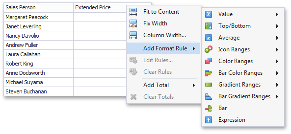

# Conditional Formatting
The Grid dashboard item supports the conditional formatting feature that provides the capability to apply formatting to grid cells whose values meet the specified condition. This feature allows you to highlight specific cells or entire rows using a predefined set of rules. To learn more about conditional formatting concepts common for all dashboard items, see the [Conditional Formatting](../../appearance-customization/conditional-formatting.md) topic.
* [Conditional Formatting Overview](#conditional-formatting-overview)
* [Create a Format Rule](#create-a-format-rule)
* [Edit a Format Rule](#edit-a-format-rule)

## <a name="conditional-formatting-overview"/>Conditional Formatting Overview
The Grid dashboard item allows you to apply conditional formatting to data items providing data to the following column types.
* [dimension column](columns/dimension-column.md);
* [measure column](columns/measure-column.md);
* [sparkline column](columns/sparkline-column.md).

> Note that you can use [hidden measures](../../binding-dashboard-items-to-data/hidden-data-items.md) to specify a condition used to apply formatting to visible values.

New appearance settings are applied to grid cells corresponding to the target dimension/measure values.

## <a name="create-a-format-rule"/>Create a Format Rule
To create a new format rule for the Grid's dimension/measure, do one of the following.
* Click the **Options** button next to the required measure/dimension, select **Add Format Rule** and choose the condition.
	
	
* Right-click the column header corresponding to the required measure/dimension and select **Add Format Rule**.
	
	
* Use the [Edit Rules](#edit-a-format-rule) dialog.

Depending on the selected format condition, the dialog used to create a format rule for Grid contains different settings.
For instance, the image below displays the **Greater Than** dialog corresponding to the [Value](../../appearance-customization/conditional-formatting/value.md) format condition.

The **Apply to row** check box allows you to specify whether to apply the formatting to the entire grid row.

## <a name="edit-a-format-rule"/>Edit a Format Rule
To edit format rules for the current Grid dashboard item, use the following options.
* Click the **Edit Rules** button in the **Home** ribbon tab or use corresponding item in the Grid context menu.
* Click the [menu button](../../ui-elements/data-items-pane.md) for the required data item and select **Edit Rules**. As an alternative, right-click the column header corresponding to the required data item and select **Edit Rules**.

All of these actions invoke the **Edit Rules** dialog containing existing format rules. To learn more, see [Conditional Formatting](../../appearance-customization/conditional-formatting.md).