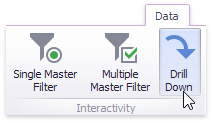

# Drill-Down
The built-in drill-down capability allows you to change the detail level of data displayed in dashboard items on the fly. To learn more about drill-down concepts common to all dashboard items, see the [Drill-Down](../../../interactivity/drill-down.md) topic.

The **Grid** dashboard item supports drill-down for rows.

When drill-down is enabled, you can click a grid row to view the details.

> [!NOTE]
> When [Master Filtering](../../cards/interactivity/master-filtering.md) is enabled, you can view the details by double-clicking a grid row.

Drill-down requires that the **Columns** section contains several dimensions at the top, from the least detailed to the most detailed dimension.

> [!NOTE]
> In OLAP mode, you can perform drill-down for either a hierarchy data item or several dimension attributes.

To enable drill-down, click the **Drill Down** button in the **Data** Ribbon tab (or the  button if you are using the toolbar menu).

To return to the previous detail level (drill up), use the **Drill Up** button (the  icon) within the grid's [caption](../../../dashboard-layout/dashboard-item-caption.md) area, or the **Drill Up** command in the grid's context menu.

