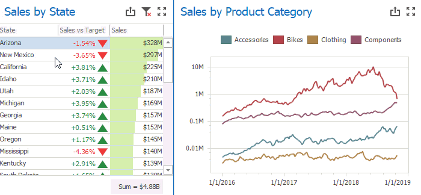
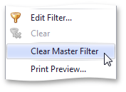

# Master Filtering
The **Dashboard** allows you to use any data aware dashboard item as a filter for other dashboard items (**Master Filter**). To learn more, see the [Master Filtering](../../../interactivity/master-filtering.md) topic, which describes filtering concepts common to all dashboard items.

## Configure Master Filters in the Designer
The **Grid** dashboard item supports filtering by rows.

When Master Filtering is enabled, you can click a grid row (or multiple rows by holding down the **CTRL** key) to make other dashboard items only display data related to the selected record(s).

To learn how to enable Master Filtering in the Designer, see the [Master Filtering](../../../interactivity/master-filtering.md) topic.

To reset filtering, use the **Clear Master Filter** button (the  icon) in the grid's [caption](../../../dashboard-layout/dashboard-item-caption.md) area, or the **Clear Master Filter** command in the grid's context menu.

