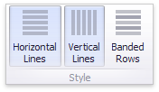

# Style
The Grid dashboard item allows you to specify various style settings.

To do this, use the **Style** group in the **Design** Ribbon tab.

* [Grid Lines](#grid-lines)
* [Banded Rows](#banded-rows)

## <a name="grid-lines"/>Grid Lines
The **Horizontal Lines** and **Vertical Lines** buttons control grid line visibility.

## <a name="banded-rows"/>Banded Rows
To paint the background of odd and even rows differently, use the **Banded Rows** button.

> [!NOTE]
> Note that banded rows are not available when [cell merging](layout.md) is enabled.