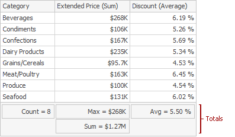
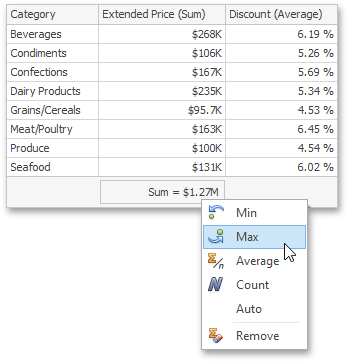
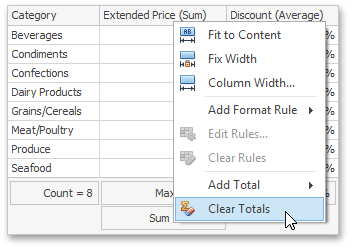

The Grid dashboard item enables you to add a summary value (a **total**) calculated against displayed values of an individual column, and show the result under this column. Note that you can add any number of totals for each column. For example, you can obtain the number of column records, average or maximum value, etc.

This topic describes how to create, edit or clear totals.

The topic consists of the following sections.
* [Totals Overview](#overview)
* [Create and Edit Totals](#create)
* [Clear Totals](#clear)

<a name="overview"/>

## Totals Overview
You can use the following summary functions when creating totals.
* **Count** - The number of records.
* **Sum** - The sum of the values.
	
	
* **Min** - The smallest value.
* **Max** - The largest value.
* **Average** - The average of the values.
	
	
* **Auto** - The total is calculated using the type of [summary function](../../../../../dashboard-for-desktop/articles/dashboard-designer/data-shaping/summarization.md) specified for the measure corresponding to the current Grid column. Note that in this case, the total is calculated based on values of the corresponding data field from the underlying data source. Note that the **Auto** type is not supported when the Grid is bound to the [OLAP](../../../../../dashboard-for-desktop/articles/dashboard-designer/providing-data/connecting-to-olap-cubes.md) data source.

You can create totals using different sets of summary functions. This depends on the type of the data source field providing data for the target column.

| Icon | Data Source Field Type | Supported Totals |
|---|---|---|
|  | Boolean | Count |
|  | Byte | Count |
|  | Date-time | Min, Max, Count |
|   | Numeric | All available types |
|  | String | Min, Max, Count |

> Note that the **Auto** type is available only for the [Measure](../../../../../dashboard-for-desktop/articles/dashboard-designer/designing-dashboard-items/grid/columns/measure-column.md) column.

<a name="create"/>

## Create and Edit Totals
To create a total, use the context menu of the column header. Right-click the required column header, select **Add Total** and specify the type of summary function used to calculate a total.

To change the total type, right-click the required total and select a new total type.

<a name="clear"/>

## Clear Totals
You can delete one total or all the totals in a particular column.
* To delete a single total, right-click a total and select **Remove**.
	
	
* To delete all column totals, right-click the column header and select **Clear Totals** in the invoked context menu.
	
	