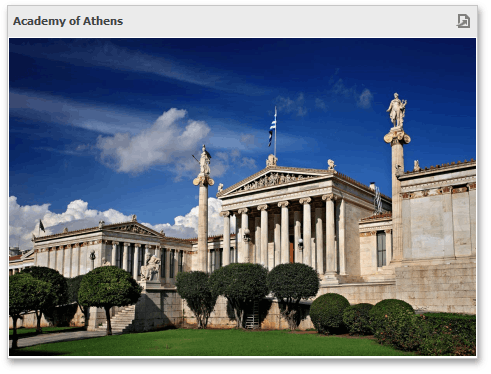

# Images
The Dashboard Designer allows you to add images to a dashboard.

You can either add a static image or you can use the Bound Image as a detail item along with the [Master Filtering](../interactivity/master-filtering.md) feature.
* [Image Types Overview](images/image-types-overview.md)
* [Providing Images](images/providing-images.md)
* [Interactivity](images/interactivity.md)
* [Image Settings](images/image-settings.md)