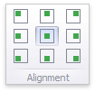

# Image Settings
You can customize the representation of Image and Bound Image dashboard items in different ways.

## Image Alignment
To specify how the image is aligned within the dashboard item, use the **Alignment** group in the **Design** ribbon tab.

## Image Size Mode
You can specify the image size mode that defines how the image fits within the dashboard item.

To do this, use the **Size Mode** group in the Ribbon's **Design** tab.

The following table illustrates each size mode in two cases: when the image is smaller than the dashboard item, and vice versa.

| Size Mode | Image Smaller than Dashboard Item | Image Larger than Dashboard Item | Description |
|---|---|---|---|
| Clip |  |  | The image is clipped if it is larger than the **Image** dashboard item. |
| Stretch |  |  | The image is stretched or shrunk to fit the size of the **Image** dashboard item. |
| Squeeze |  |  | If the dimensions of the **Image** dashboard item exceed those of the image it contains, the image is shown in full-size. Otherwise, the image is resized to fit the dimensions of the **Image** dashboard item. |
| Zoom |  |  | The image is sized proportionally (without clipping), so that it best fits the **Image** dashboard item. If the aspect ratio of the **Image** dashboard item is the same as the aspect ratio of the image, it will be resized to fit into the **Image** dashboard item while maintaining its aspect ratio. Otherwise, the image will be resized in the closest fitting dimension (either the height or the width), and the remaining dimension will be resized while maintaining the image's aspect ratio. |