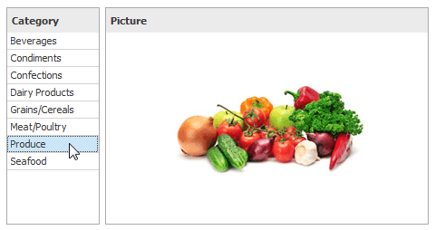

# Interactivity
This document describes the features that enable interaction between the **Bound Image** and other dashboard items. These features include **Master Filtering**.

## Master Filtering
The Dashboard allows you to use most of the data-aware dashboard items as a filter for other dashboard items (**Master Filter**). To learn more, see the [Master Filtering](../../interactivity/master-filtering.md) topic, which describes filtering concepts common to all dashboard items.

Data displayed in the **Bound Image** dashboard item can be filtered by other master filter items. For instance, the **Bound Image** below shows an image corresponding to a category selected in the [Grid](../grid.md) dashboard item.

You can prevent the Bound Image from being affected by other master filter items using the **Ignore Master Filters** button on the **Data** ribbon tab.

