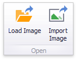

# Providing Images
## Providing Static Images
To load an image to a dashboard item, use the **Load Image** and **Import Image** buttons in the Ribbon, or commands in the context menu (**Load Image...** and **Import Image...**, respectively).

These commands invoke the **Open** dialog, which allows you to locate the desired image.

The **Load Image** command saves the path to the image in the dashboard definition, while the **Import Image** command saves the image itself.

## Binding the Bound Image to Data
The Bound Image dashboard item provides the Attribute data section containing the corresponding placeholder.

Specify the binding mode for the Bound Image by clicking the Options button (the  icon) next to the Attribute placeholder. This invokes the following dialog.

This dialog provides two options.
* **Binary Array** - Use this mode if images are stored in the data source as byte arrays.
* **URI** - Use this mode to locate images accessible by a predefined URI. In this case, the data source field should return strings that are parts of URIs to these images.

For instance, the URI pattern in the form below specifies the path to the folder containing the required images.

Data source field values will be inserted to the position of the {0} placeholder. Thus, the Bound Image maps the current dimension value with the image placed at the specified URI.

> [!NOTE]
> Note that the Bound Image can display only a single image simultaneously. If [Master Filtering](../../interactivity/master-filtering.md) is not applied to the Bound Image, it selects the displayed image in the following ways.
> * In the **Binary Array** mode, the displayed image cannot be predicted precisely as a result of sorting limitations for the _image_/_binary_ data types. Use the [Master Filtering](../../interactivity/master-filtering.md) feature to display the specified image.
> * In the **URI** mode, the Bound Image displays an image corresponding a first attribute value taking into account the attribute's sort order.