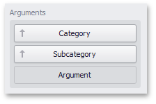
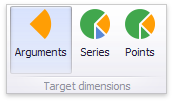
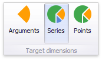

# Drill-Down
The built-in drill-down capability allows you to change the detail level of data displayed in dashboard items on the fly. To learn more about drill-down concepts common to all dashboard items, see the [Drill-Down](../../../interactivity/drill-down.md) topic.

The **Pie** dashboard item supports drill-down on **argument** or **series** values.

## Drill Down on an Argument
When drill down on an argument is enabled, you can click a pie segment to view a detail diagram for the corresponding argument value.

> [!NOTE]
> When [Filtering by Arguments](master-filtering.md) is enabled, you can view the details by double-clicking a pie segment.

Drill down on an argument requires that the Arguments section contains several data items, from the least detailed to the most detailed item.

> [!NOTE]
> In OLAP mode, you can perform drill-down for either a hierarchy data item or several dimension attributes.

To enable drill down on an argument, click the **Drill Down** button in the **Data** Ribbon tab (or the  button if you are using the toolbar menu)...

...and the **Arguments** button (or the  button if you are using the toolbar menu).

## Drill Down on a Series
When drill down on a series is enabled, you can click a pie chart to view a detail diagram for the corresponding series value.

> [!NOTE]
> When [Filtering by Series](master-filtering.md) is enabled, you can view the details by double-clicking a pie chart.

Drill down on a series requires that the Series section contains several data items, from the least detailed to the most detailed item.

> [!NOTE]
> In **OLAP** mode, you can perform drill-down for either a hierarchy data item or several dimension attributes.

To enable drill down on a series, click the **Drill Down** button in the **Data** Ribbon tab (or the  button if you are using the toolbar menu)...

...and the **Series** button (or the  button if you are using the toolbar menu).

## Drill Up
To return to the previous detail level (drill up), use the **Drill Up** button (the  icon) in the [caption](../../../dashboard-layout/dashboard-item-caption.md) area of the Pie dashboard item, or the **Drill Up** command in the context menu.