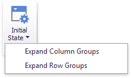

# Expanded State
If the [Columns or Rows](providing-data.md) section contains several data items, the Pivot column and row headers are arranged in a hierarchy and make up column and row groups.

You can collapse and expand row and column groups using the  and  buttons. However, the current expanded state of column and row groups do not save in the dashboard definition. If necessary, you can specify the default expanded state using the **Initial State** button in the **Design** ribbon tab.

This button invokes the popup menu that allows you to select whether column and row groups should be collapsed or expanded by default.