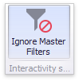

# Interactivity
This document describes the features that enable interaction between the **Pivot** and other dashboard items. These features include **Master Filtering**.

## Master Filtering
The Dashboard allows you to use any data-aware dashboard item as a filter for other dashboard items (**Master Filter**). To learn more, see the [Master Filtering](../../interactivity/master-filtering.md) topic, which describes filtering concepts common to all dashboard items.

Data displayed in the Pivot dashboard item can be filtered by other master filter items. You can prevent the pivot from being affected by other master filter items using the **Ignore Master Filters** button on the **Data** Ribbon tab.

