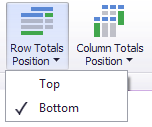
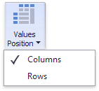

# Layout
This topic describes how to control the Pivot dashboard item layout, the visibility of totals and grand totals, etc.
* [Layout Type](#layouttype)
* [Totals Visibility](#totalsvisibility)
* [Totals Position](#totalsposition)
* [Values Visibility](#valuesvisibility)
* [Values Position](#valuesposition)
* [Reset Layout Options](#resetlayout)

## <a name="layouttype"/>Layout Type
If the Pivot dashboard item contains a hierarchy of dimensions in the [Rows](providing-data.md) section, you can specify the layout used to arrange values corresponding to individual groups.

| Layout type | Example | Description |
|---|---|---|
| **Compact** |  | Displays values from different Row dimensions in a single column. Note that in this case totals are shown at the top of a group, and you cannot change [totals position](#totalsposition). |
| **Tabular** |  | Displays values from different Row dimensions in separate columns. |

Use the **Layout** button in the **Design** ribbon tab to change the Pivot layout.

## <a name="totalsvisibility"/>Totals Visibility
You can control the visibility of totals and grand totals for the entire Pivot dashboard item. For instance, the image below displays the Pivot dashboard item with the disabled row totals.

To manage the visibility of totals and grand totals, use the **Totals** and **Grand Totals** buttons in the **Design** ribbon tab, respectively.

These buttons invoke a popup menu that allows you to manage the visibility of column and row totals/grand totals separately.

Moreover, you can control the visibility of totals for individual dimensions/measures by using the data item's context menu (**Show Totals** and **Show Grand Totals** options).

## <a name="totalsposition"/>Totals Position
If necessary, you can change the Pivot dashboard item’s totals/grand totals position. For instance, in the image below the row totals are moved from the bottom to the top.

To manage totals position, use the **Row Totals Position** and **Column Totals Position** buttons in the **Design** ribbon tab.

## <a name="valuesvisibility"/>Values Visibility
The Pivot dashboard item can contain several measures in the [Values](providing-data.md) section to hide summary values corresponding to specific measures. For instance, the image below shows the Pivot with hidden _Quantity_ values.

To do this, use the **Show Values** command in the measure menu.

## <a name="valuesposition"/>Values Position
The Pivot dashboard item allows you to control the position of headers used to arrange summary values corresponding to different measures. For instance, you can display values in columns or rows.

To manage this position, use the **Values Position** button in the **Design** ribbon tab.

## <a name="resetlayout"/>Reset Layout Options
To reset layout options, click the **Reset Layout Options** button in the **Design** ribbon tab.

