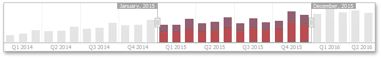

# Range Filter
The **Range Filter** dashboard item allows you to apply filtering to other dashboard items. This item displays a chart with selection thumbs that allow you to filter out values displayed along the argument axis.

This section consists of the following subsections.
* [Providing Data](range-filter/providing-data.md)
	
	Explains how to supply the Range Filter dashboard item with data.
* [Series](range-filter/series.md)
	
	Enumerates and describes different types of series that can be displayed within the Range Filter dashboard item.
* [Interactivity](range-filter/interactivity.md)
	
	Describes features that enable interaction between the Range Filter and other dashboard items.
* [Predefined Ranges](range-filter/predefined-ranges.md)
	
	Shows you how to add predefined date-time periods that can be used to perform a selection (for instance, _year-to-date_ or _quarter-to-date_).
* [Coloring](range-filter/coloring.md)
	
	Describes coloring capabilities of the Range Filter dashboard item.