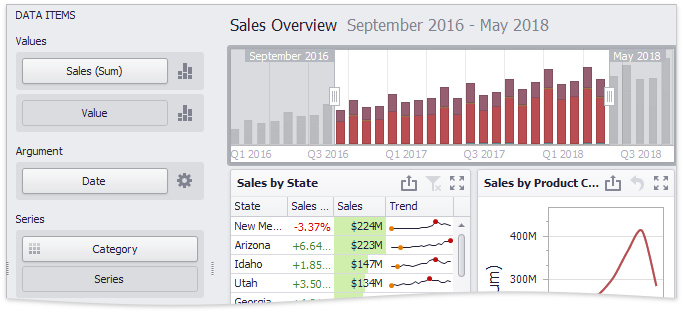

# Coloring
Certain dashboard items provide the capability to color dashboard item elements by associating dimension values/measures and specified colors. You can choose whether to use a global color scheme to provide consistent colors for identical values or specify a local color scheme for each dashboard item. To learn more about coloring concepts common for all dashboard items, see the [Coloring](../../appearance-customization/coloring.md) section.

By default, the Range Filter dashboard item colors different measures and series dimensions by hue. The image below illustrates the Range Filter dashboard item whose series points corresponding to different categories are colored in different colors.

